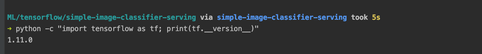
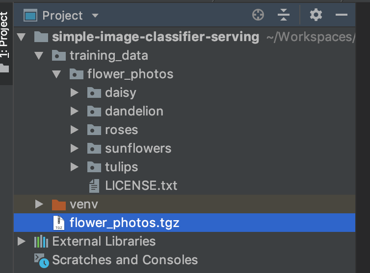
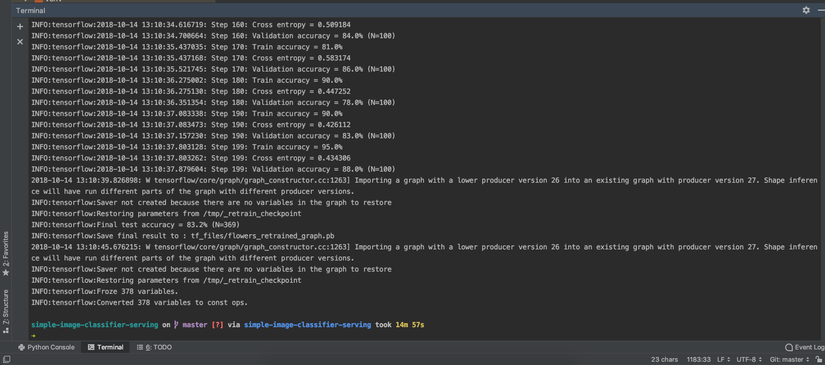

# [Từng bước triển khai một mô hình Deep Learning lên "server"](https://viblo.asia/p/tung-buoc-trien-khai-mot-mo-hinh-deep-learning-len-server-GrLZDxwOZk0)


Ở bài viết này mình sẽ hướng dẫn từng bước xây dựng và đưa một mô hình DL lên môi trường "production".

Bài viết chỉ hướng dẫn, tổng hợp lại những bài viết về DL có sẵn, sử dụng thư viện có sẵn(TensorFlow) nên bài viết không có chút gì về toán hay thuật toán.

Khi mình bắt đầu đọc về DL, ML... Mình đã đọc khá nhiều các bài viết về việc tạo ra các model DL, ML và đa số các bài viết thường dừng lại ở bước đánh, thử nghiệm model. Việc triển khai lên server thì ít được nhắc tới, "Làm thế nào để tạo được 1 http api để các service khác có thể sử dụng được model đã train đó?" - Đây là câu hỏi mình nhận được từ một vài người.

Việc đưa một model lên môi trường production hay đơn giản chỉ là tạo một http service là việc tương đối đơn giản so với các bước tạo ra 1 model, nhưng với những người không quá thành thạo việc sử dụng ngôn ngữ lập trình, hay các model được training sẵn đã đáp ứng được yêu cầu của họ, thì việc triển khai này sẽ là vấn đề lớn nhất 😄


## Training một mô hình DL

Để thực hiện hướng dẫn đơn giản nhất, mình sử dụng hướng dẫn và dữ liệu từ bài viết https://www.tensorflow.org/tutorials/image_retraining

Những yêu cầu bắt buộc trước khi thực hiện theo các hướng dẫn:

> Có thể lập trình bằng ngôn ngữ Python
> Cài đặt môi trường lập trình cho Python
> Cài đặt gói tensorflow (Khuyên dùng virtualenv https://www.tensorflow.org/install/pip)
> Kiểm tra version tensorflow đã được cài đặt bằng lệnh
```python
python -c "import tensorflow as tf; print(tf.__version__)"
```



Như trong hình thì mình sử dụng môi trường `env` ở thư mục `simple-image-classifier-serving` và `tensorflow` đang là version 1.11.0 (mới nhất 😐)

## Retrain

Như đã nói ở trên, hướng dẫn này mình sẽ sử dụng dữ liệu và mô hình được xây dựng sẵn, nên mình sẽ không phải xây dựng dữ liệu để train nữa, chỉ tải về và dùng thôi.

Việc tạo dữ liệu cho bài toán phân lớp ảnh thì mình thường dùng các công cụ để tài ảnh từ Google image search, trong đó có `Chrome extension Fatkun Batch Download Image` và pip package [google_images_download](https://github.com/hardikvasa/google-images-download)

### 1. Tải dữ liệu training

Tại thư mục project sử dụng command:
```command
curl -O http://download.tensorflow.org/example_images/flower_photos.tgz && \
mkdir training_data && \
tar xzf flower_photos.tgz -C ./training_data;
```
Các công việc mà command thực hiện:

> Tải xuống file nén chứa dữ liệu có tên flower_photos.tgz (nặng 218MB)
> Tạo ra một thư mục có tên training_data
> Giải nén dữ liệu vào thư mục vừa tạo.

Kết quả chúng ta có: 


### 2.Training

Tạo một thư mục có tên `scripts` để chứa `retrain` script, thư mục `tf_files` để chứa các file sinh ra cần thiết.

> Tải file `retrain.py`

```command
curl -Lo ./scripts/retrain.py  https://github.com/tensorflow/hub/raw/master/examples/image_retraining/retrain.py
```

> Retraining

Để thực hiện retrain, chúng ta có thể sử dụng command đơn giản
```command
python scripts/retrain.py --image-dir ./training_data/flower_photos 
```

Với lệnh này, nhiều cấu hình sẽ là giá trị mặc định (có thể đọc nội dung file `retrain.py`)

Chúng ta sẽ thay đổi một số giá trị mặc định:
```command
python scripts/retrain.py \
   --output_graph=tf_files/flowers_retrained_graph.pb \
   --output_labels=tf_files/flowers_labels.txt \
   --image_dir=training_data/flower_photos \
   --how_many_training_steps=200
```
Các thông số đã khá rõ ràng về chức năng, `how_many_training_steps` giảm số lượng số bước train (mặc định là 4000), theo "lý thuyết" mô hình `ImageNet` sẽ tối ưu với số bước train là 4000, nhưng để tiết kiệm thời gian mình sẽ giảm xuống.

Thông thường để train xong dữ liệu này, mình thường mất 30 phút cho chế độ mặc định(mình dùng laptop có chip xử lý yếu - `Intel(R) Core(TM) i5-7267U CPU @ 3.10GHz` (len))

Nếu có gặp lỗi:
```command
Traceback (most recent call last):
     File "scripts/retrain.py", line 133, in <module>
       import tensorflow_hub as hub
ModuleNotFoundError: No module named 'tensorflow_hub'
```
Các bạn hãy cài thêm package `tensorflow_hub`:
```command
pip install tensorflow_hub
```
Các bạn dùng macos có thể sẽ gặp một lỗi liên quan tới chứng chỉ xác thực `ssl` khi script thực hiện lệnh `INFO:tensorflow:Downloading TF-Hub Module 'https://tfhub.dev/google/imagenet/inception_v3/feature_vector/1'`. Các bạn có thể tìm hướng dẫn trên mạng Internet, cập nhật ssl cerfiticates cho python(lưu ý, việc cập nhật ssl cer phải thực hiện ở môi trường python global, không phải môi trường virtualenv).

Quá trình retrain:


Trong quá trình training 😐


Hoàn thành quá trình training. Chúng ta có file model và file lable.




Thời gian train: 14m57s

Năng lượng: Pin laptop tụt từ 69% về 63% 😄

## Sử dụng mô hình vừa train
Tải xuống file `label_image.py`

```command
curl -Lo ./scripts/label_image.py https://github.com/tensorflow/tensorflow/raw/master/tensorflow/examples/label_image/label_image.py
```
Xác định nhãn của một bức ảnh
```command
python scripts/label_image.py \
   --graph=tf_files/flowers_retrained_graph.pb \
   --labels=tf_files/flowers_labels.txt \
   --input_layer=Placeholder \
   --output_layer=final_result \
   --image=training_data/flower_photos/daisy/21652746_cc379e0eea_m.jpg
```
Kết quả:
```command
2018-10-14 13:25:24.667487: I tensorflow/core/platform/cpu_feature_guard.cc:141] Your CPU supports instructions that this TensorFlow binary was not compiled to use: AVX2 FMA
daisy 0.9510209
sunflowers 0.033528723
dandelion 0.008771326
tulips 0.005201864
roses 0.001477076
```
Chúng ta có thể thêm 2 dòng này vào đầu file `label_image.py` để loại bỏ warning được in ra std:
```command
# Just disables the warning, doesn't enable AVX/FMA
import os
os.environ['TF_CPP_MIN_LOG_LEVEL'] = '2'
```

Mô hình đã "hoạt động", nhưng chúng ta vừa sử dụng một training data để thực hiện test, như thế là chưa "khách quan". Mình sẽ lên mạng tải một bức ảnh hoa hướng dương về để thử nghiệm. 


Kết quả (khoc2)
```command
python scripts/label_image.py \
   --graph=tf_files/flowers_retrained_graph.pb \
   --labels=tf_files/flowers_labels.txt \
   --input_layer=Placeholder \
   --output_layer=final_result \
   --image=test_data/flower_photos/huong_duong_do.jpg                                         
sunflowers 0.9275313
daisy 0.034505673
dandelion 0.019276036
tulips 0.010451643
roses 0.008235327
```
## Serving model
Ở phần này, chúng ta sẽ xây dựng một http api sử dụng model ở phần trên để tạo ra một service phân loại ảnh.

Yêu cầu: Client request tới service gửi kèm 1 bức ảnh (upload, url), trả lại kết quả đánh nhãn cho ảnh đó.

## HTTP API với Flask
Mới làm quen với ngôn ngữ python, nên mình chọn Flask vì package này đơn giản và có nhiều hướng dẫn. Tạo file `app.py`

```python
#!flask/bin/python
from flask import Flask, request, jsonify

app = Flask(__name__)


@app.route('/')
def hello_world():
    return "Hello World!"


@app.route('/classify', methods=['POST', 'GET'])
def classify():
    try:
        if request.method == 'POST':
            return jsonify({
                'method': "POST"
            })
        elif request.method == 'GET' and request.args.get('image_url', '') != '':
            image_url = request.args.get('image_url')
            return jsonify({
                'method': 'GET',
                'image_url': image_url
            })
        else:
            return jsonify({
                'message': 'Action is not defined!'
            }), 404
    except Exception as e:
        return repr(e), 500


if __name__ == '__main__':
    app.run(debug=True, host='127.0.0.1', port=12480)

```
Chạy ứng dụng

```command
python server/app.py
```
Dùng Postman để test thử các route.

Tạo file `utils.py` trong thư mục `common` chứa các hàm hỗ trợ lưu file từ việc upload hay từ url
```python
import os
import urllib.request

UPLOAD_FOLDER = './temp'
ALLOWED_EXTENSIONS = {'txt', 'pdf', 'png', 'jpg', 'jpeg', 'gif'}


def allowed_file(filename):
    return '.' in filename and \
           filename.rsplit('.', 1)[1].lower() in ALLOWED_EXTENSIONS


def download_image_from_url(image_url):
    filename = image_url.split('/')[-1]
    urllib.request.urlretrieve(image_url, UPLOAD_FOLDER + '/' + filename)
    return filename


def save_upload_file(file):
    """
    Save file
    :param file: request.files['image']
    """
    filename = file.filename
    if file and allowed_file(filename):
        file.save(os.path.join(UPLOAD_FOLDER, filename))
        return filename
    else:
        return ''

```

Cập nhật lại file app.py cho các trường hợp upload file hay truyền lên url

```python
#!flask/bin/python
from flask import Flask, request, jsonify
import common.utils as utils

app = Flask(__name__)


@app.route('/')
def hello_world():
    return "Hello World!"


@app.route('/classify', methods=['POST', 'GET'])
def classify():
    try:
        if request.method == 'POST':
            # check if the post request has the image part
            if 'image' not in request.files:
                return jsonify({
                    'message': 'No file part'
                }), 400
            file = request.files['image']
            # if user does not select file, browser also
            # submit an empty part without filename
            if file.filename == '':
                return jsonify({
                    'message': 'No selected file'
                }), 400
            filename = utils.save_upload_file(file)
            return jsonify({
                'method': "POST",
                'filename': filename
            })
        elif request.method == 'GET' and request.args.get('image_url', '') != '':
            image_url = request.args.get('image_url')
            filename = utils.download_image_from_url(image_url)
            return jsonify({
                'method': 'GET',
                'image_url': image_url,
                'file_name': filename
            })
        else:
            return jsonify({
                'message': 'Action is not defined!'
            }), 404
    except Exception as e:
        return repr(e), 500


if __name__ == '__main__':
    app.run(debug=True, host='127.0.0.1', port=12480)

```
Mọi thứ hoạt động tốt, file được lưu trong thư mục `./temp`

## Hàm hỗ trợ phân lớp ảnh.

Như các bạn đã thấy ở trên, để phân loại được 1 ảnh ta phải truyền khá nhiều tham số cho file `label_image.py`, từ file này mình sẽ viết lại một file wrap lại function phân loại ảnh, đầu vào chỉ là tên ảnh, đầu ra là kết quả phân loại ảnh.

Việc viết lại cũng khá đơn giản, chúng ta chỉ cần fix các giá trị mặc định (label, model...) `common/tf_classify`

```python
import os

import tensorflow as tf

# Just disables the warning, doesn't enable AVX/FMA
os.environ['TF_CPP_MIN_LOG_LEVEL'] = '2'

# Relative path with app.py file
UPLOAD_FOLDER = './temp'
LABELS_FILE = './tf_files/flowers_labels.txt'
MODEL_FILE = './tf_files/flowers_retrained_graph.pb'


def read_tensor_from_image_file(file_name,
                                input_height=299,
                                input_width=299,
                                input_mean=0,
                                input_std=255):
    input_name = "file_reader"
    # output_name = "normalized"
    file_reader = tf.read_file(file_name, input_name)
    if file_name.endswith(".png"):
        image_reader = tf.image.decode_png(
            file_reader, channels=3, name="png_reader")
    elif file_name.endswith(".gif"):
        image_reader = tf.squeeze(
            tf.image.decode_gif(file_reader, name="gif_reader"))
    elif file_name.endswith(".bmp"):
        image_reader = tf.image.decode_bmp(file_reader, name="bmp_reader")
    else:
        image_reader = tf.image.decode_jpeg(
            file_reader, channels=3, name="jpeg_reader")
    float_caster = tf.cast(image_reader, tf.float32)
    dims_expander = tf.expand_dims(float_caster, 0)
    resized = tf.image.resize_bilinear(dims_expander, [input_height, input_width])
    normalized = tf.divide(tf.subtract(resized, [input_mean]), [input_std])
    sess = tf.Session()
    result = sess.run(normalized)

    return result


def label_image(image_name):
    image_path = UPLOAD_FOLDER + '/' + image_name
    # Read in the image_path
    image_data = read_tensor_from_image_file(image_path)
    # Loads label file, strips off carriage return
    label_lines = [line.rstrip() for line
                   in tf.gfile.GFile(LABELS_FILE)]
    # Unpersists graph from file
    output = {}
    with tf.gfile.FastGFile(MODEL_FILE, 'rb') as f:
        graph_def = tf.GraphDef()
        graph_def.ParseFromString(f.read())
        _ = tf.import_graph_def(graph_def, name='')
    # Feed the image_data as input to the graph and get first prediction
    with tf.Session() as sess:
        softmax_tensor = sess.graph.get_tensor_by_name('final_result:0')
        # print(softmax_tensor)
        predictions = sess.run(softmax_tensor,
                               {'Placeholder:0': image_data})
        # Sort to show labels of first prediction in order of confidence
        top_k = predictions[0].argsort()[-len(predictions[0]):][::-1]

        for node_id in top_k:
            human_string = label_lines[node_id]
            score = predictions[0][node_id]
            output[human_string] = float(score)
            print('%s (score = %.5f)' % (human_string, score))
    return output
```
Sử dụng ở file app.py

```python
output = image_classifier.label_image(filename)
return jsonify({
    'filename': filename,
    'labels': output
})

```

Kết quả thử phân loại ảnh từ url
```command
curl -X GET http://127.0.0.1:12480/classify?image_url=https://kenh14cdn.com/2016/sunflower-002-1470471840262.jpg'
```
```json
{
  "filename": "sunflower-002-1470471840262.jpg", 
  "labels": {
    "daisy": 0.09283825755119324, 
    "dandelion": 0.031017528846859932, 
    "roses": 0.010368549264967442, 
    "sunflowers": 0.8581708669662476, 
    "tulips": 0.007604836020618677
  }
}
```
Sau khi thử vài ảnh, chúng ta có thể thấy thời gian request là khá lâu (trung bình 6s). Nguyên nhân vì trong hàm `label_image` lặp lại các công việc đọc label file, load graph, khởi tạo session. Chúng ta sẽ tối ưu lại hàm này, bằng cách đưa các công việc trên ra ngoài, chỉ làm 1 lần:

```python
def label_image(image_name, label_lines, sess):
    image_path = UPLOAD_FOLDER + '/' + image_name
    # Read in the image_path
    image_data = read_tensor_from_image_file(image_path)

    output = {}

    # Feed the image_data as input to the graph and get first prediction
    softmax_tensor = sess.graph.get_tensor_by_name('final_result:0')
    # print(softmax_tensor)
    predictions = sess.run(softmax_tensor,
                           {'Placeholder:0': image_data})
    # Sort to show labels of first prediction in order of confidence
    top_k = predictions[0].argsort()[-len(predictions[0]):][::-1]

    for node_id in top_k:
        human_string = label_lines[node_id]
        score = predictions[0][node_id]
        output[human_string] = float(score)
        print('%s (score = %.5f)' % (human_string, score))
    return output
```
Khởi tạo các biến cần thiết cho hàm label_image ở file app.py
```python
# Loads label file, strips off carriage return
label_lines = [line.rstrip() for line
               in tf.gfile.GFile(LABELS_FILE)]

# Unpersists graph from file
with tf.gfile.FastGFile(MODEL_FILE, 'rb') as f:
    graph_def = tf.GraphDef()
    graph_def.ParseFromString(f.read())
    _ = tf.import_graph_def(graph_def, name='')

sess = tf.Session()
```
Giờ chạy lại server, chúng ta thấy chỉ request đầu tiên mất nhiều thời gian, còn những request sau đó thì mất ít thời gian hơn(< 1s).

Kết luận
Việc triển khai model ML lên server là công việc không quá phức tạp, nhưng cũng có nhiều vấn đề mà chúng ta cần lưu ý.

Hy vọng với bài viết của mình, các bạn sẽ có thêm ý tưởng để xây dựng sản phẩm cho riêng mình.

[Source code](https://github.com/hoangsetup/simple-image-classifier-serving)