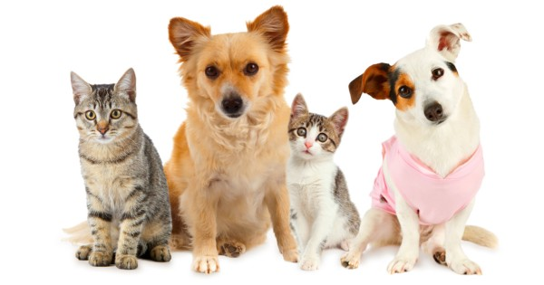
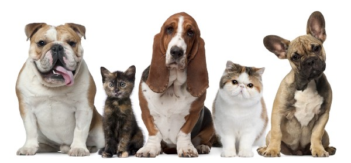
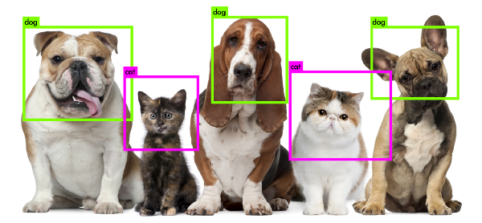
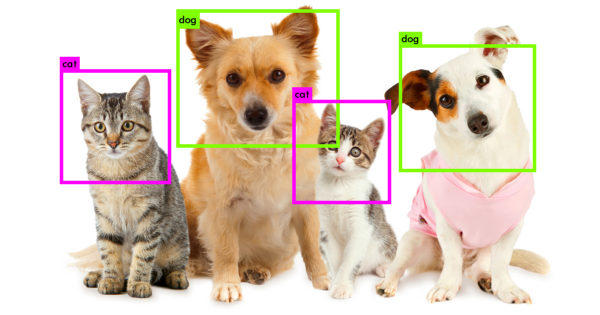

# [How to train multiple objects in YOLOv2 using your own Dataset](https://medium.com/@manivannan_data/how-to-train-multiple-objects-in-yolov2-using-your-own-dataset-2b4fee898f17)

If you have not seen my previous post for training single object in yolo i recommend you read it. Please click [here](https://medium.com/@manivannan_data/how-to-train-yolov2-to-detect-custom-objects-9010df784f36).

My Configuration:

```
OS: Ubuntu 16.04
Python Version: 2.7
GPU: 4gb
```

Now we are trying to train multiple objects in YOLO with cat and dog dataset.

Now i am using two objects to train in yolo.

Please Download the dataset from [here](https://www.dropbox.com/s/s1j08g5sa5pdgvv/Cat-Dog-Image-Dataset.zip?dl=0)

Extract the downloded dataset, It contains cat and dog images.

## Data Preparation

Please follow the New Yolo Annotation Tool(latest update) for data preparation and skip the two steps(step 1 and step 2) and go to step 3 in this blog if your used new tool for data preparation. I have explained full description on New Yolo Annotation Tool blog. Please find the [new tool link](https://medium.com/@manivannan_data/yolo-annotation-tool-new-18c7847a2186).

### Step 1:
- Download my git repository [here](https://github.com/ManivannanMurugavel/YOLO-Annotation-Tool)
- Run main.py to generate the dataset
- Please follow the video to create the bounding box to our dataset

[youtube]

### Step 2:
- To create the final txt file to all images where the object position on image.
- Run convert.py to create the txt file
- Please follow the video to create the final txt file with two object

[youtube]

### Step 3:
- Get training(80%) and testing(20%) dataset from this dataset
- Run process.py
- Please follow the video to get train and test dataset.

[youtube]

## Preparing YOLOv2 configuration files

YOLOv2 needs certain specific files to know how and what to train. We’ll be creating these three files. I am using 4GB GPU. So i am used yolo.cfg:

- cfg/obj.data
- cfg/obj.names
- cfg/yolo-obj.cfg

Create obj.data file inside cfg folder and paste below code

Note: The **two-object** is where to store the final weights file

```
classes= 2 
train  = train.txt  
valid  = test.txt  
names = obj.names  
backup = two-object/
```

Create obj.names file inside cfg folder and paste below code

```
cat
dog
```

just duplicated the yolo.cfg file, and made the following edits:

- Line 3: set `batch=24`, this means we will be using 64 images for every training step
- Line 4: set `subdivisions=8`, the batch will be divided by 8 to decrease GPU VRAM requirements. If you have a powerful GPU with loads of VRAM, this number can be decreased, or batch could be increased. The training step will throw a CUDA out of memory error so you can adjust accordingly.
- Line 244: set `classes 2`, the number of categories we want to detect
- Line 237: set `filters=(classes + 5)*5` in our case `filters=35`

To start training, YOLOv2 requires a set of convolutional weights.

This conv.23 file can be [**downloaded**](https://pjreddie.com/media/files/darknet19_448.conv.23) (76Mb) from the official YOLOv2 website and provides an excellent starting point. We’ll need this file for the next step.

## Training

Time for the fun part! Enter the following command into your terminal and watch your GPU do what it does best (copy your train.txt and test.txt to yolo_darknet folder):

```
manivannan@manivannan-whirldatascience:~/YoloExample/darknet$ ./darknet detector train cfg/obj.data cfg/yolo-obj.cfg darknet19_448.conv.23
```

> **Note**: When completed 100 iteration it will automatically store weights file and kill the process once the average loss is less than 0.06 to get good a accuracy. But my average loss is 0.02

## Results

We should now have a .weights file that represents our trained model. Let’s use this on some images to see how well it can detect the cat and dog. This command unleashes YOLOv2 on an image of our choosing.If you want my trained weights file you try download [here](https://www.dropbox.com/s/3w0vcwvzk6kkfzi/Cat-Dog-Yolo.weights?dl=0).

```
manivannan@manivannan-whirldatascience:~/YoloExample/darknet$ ./darknet detector test cfg/obj.data cfg/yolo-obj.cfg Cat-Dog-Yolo.weights data/manivannan.jpg
```

Input Image




Output Image




