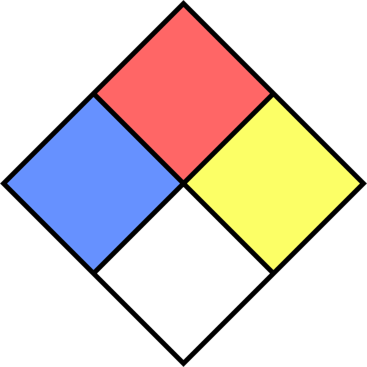
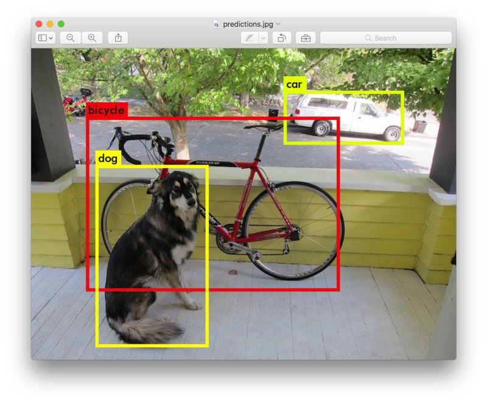
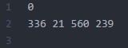
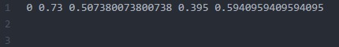
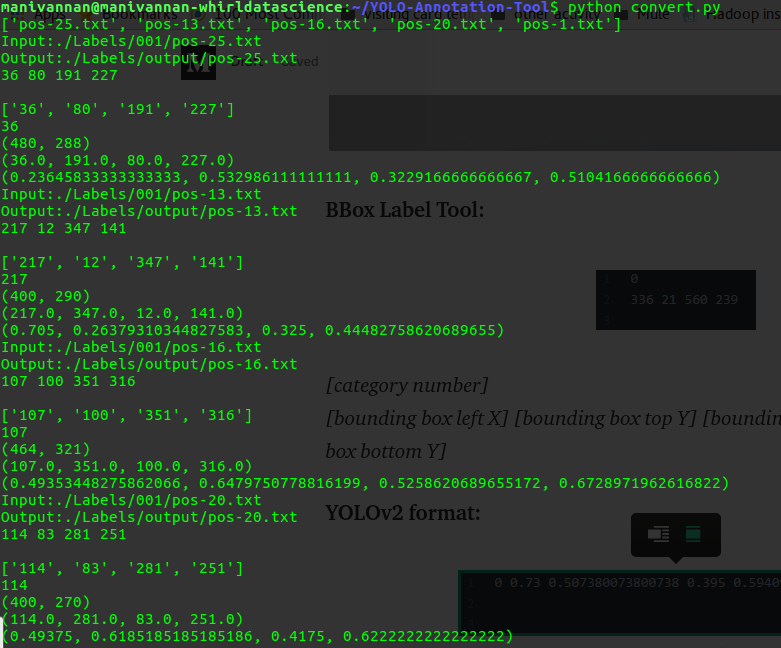
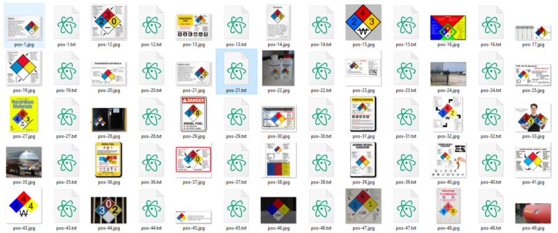
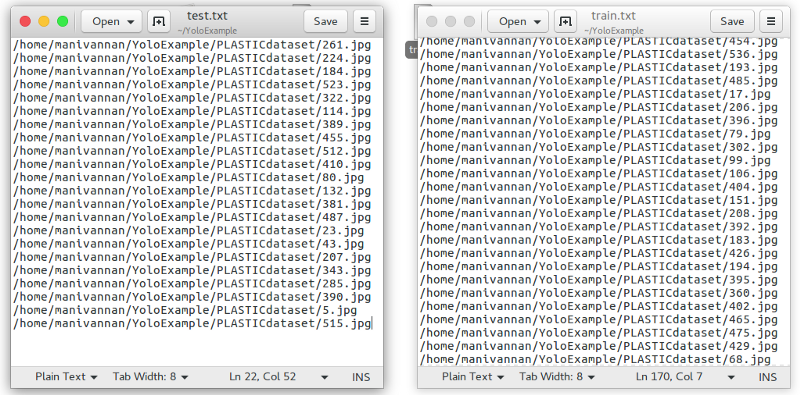
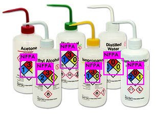
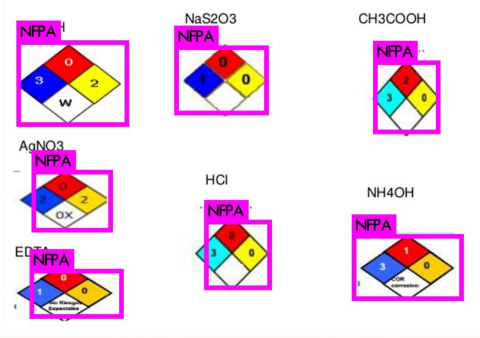
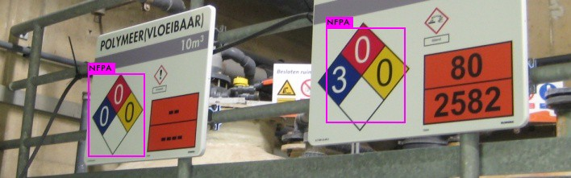

## [How to train YOLOv2 to detect custom objects][source]

yolo train with custom object (ubuntu 16.04)

My Requirements:

```
OS: Ubuntu 16.04
Python Version: 2.7
GPU: 1gb
```

The custom object we want to detect in this article is the NFPA 704 ‘fire diamond’.



The data set I composed for this article can be found [here](https://timebutt.github.io/content/other/NFPA_dataset.zip) (19.4Mb).

## Installing Darknet

```command
ubuntu:~$ git clone https://github.com/AlexeyAB/darknet.git
ubuntu:~$ cd darknet
```

(Note you want GPU please follow the steps. Important GPU is needed to training otherwise not need)

```command
ubuntu:~$ vi Makefile
```

(Change the GPU 0 to 1 and save it. If you installed openCV set OPENCV 0 to 1 otherwise not need)

```command
ubuntu:~$ make
```

If you have **any errors**, try to fix them? If everything seems to have compiled correctly, try running it!

```command
./darknet
```

You should get the output:

```command
usage: ./darknet <function>
```

## Yolo Testing

You already have the config file for YOLO in the cfg/ subdirectory. You will have to download the pre-trained weight file [here](https://pjreddie.com/media/files/yolo.weights) (258 MB). Or just run this:

```command
wget https://pjreddie.com/media/files/yolo.weights
```

Then run the detector!

```command
./darknet detect cfg/yolo.cfg yolo.weights data/dog.jpg
```

You will see some output like this:

```command
layer     filters    size              input                output
    0 conv     32  3 x 3 / 1   416 x 416 x   3   ->   416 x 416 x  32
    1 max          2 x 2 / 2   416 x 416 x  32   ->   208 x 208 x  32
    .......
   29 conv    425  1 x 1 / 1    13 x  13 x1024   ->    13 x  13 x 425
   30 detection
Loading weights from yolo.weights...Done!
data/dog.jpg: Predicted in 0.016287 seconds.
car: 54%
bicycle: 51%
dog: 56%
```



If you want more information about darknet please refer [link](https://pjreddie.com/darknet/yolo/)

## Data annotation

Main thing for creating text file of images (Just understand the following 2 Steps)

1 Create `.txt`-file for each `.jpg`-image-file - in the same directory and with the same name, but with `.txt`-extension, and put to file: object number and object coordinates on this image, for each object in new line: `<object-class> <x> <y> <width> <height>`

Where:

- `<object-class>` - integer number of object from `0` to (`classes-1`)
- `<x> <y> <width> <height>` - float values relative to width and height of image, it can be equal from 0.0 to 1.0
- for example: `<x> = <absolute_x> / <image_width> or <height> = <absolute_height> / <image_height>`
- attention: `<x> <y>` - are center of rectangle (are not top-left corner)

For example for `img1.jpg` you should create `img1.txt` containing:

```
1 0.716797 0.395833 0.216406 0.147222
0 0.687109 0.379167 0.255469 0.158333
1 0.420312 0.395833 0.140625 0.166667
```
Example

```
My Image Size: 360 * 480 it have one object ie:dog
image_width = 360
image_height = 480
absolute_x = 30 (dog x position from image)
absolute_y = 40 (dog y position from image)
absolute_height = 200 (original height of dog from image)
absolute_width = 200 (original width of dog from image)
```

The final Text file have. It have five args and all five args between 0 to 1

```
<class_number> (<absolute_x> / <image_width>) (<absolute_y> / <image_height>) (<absolute_width> / <image_width>) (<absolute_height> / <image_height>)
ie:
0 (30/360) (40/480) (200/360) (200/480)
0 0.0833 0.0833 0.556 0.417
```

## YOLO Training Started

Note: Please train this data with one object after successful then start your own or custom data(with multiple object).

I have announced new annotation tool for data annotation. Please find the new tool [link](https://medium.com/@manivannan_data/yolo-annotation-tool-new-18c7847a2186) for data preparation. If your used new tool, please don’t run the main.py and convert.py in this blog and directly move to run process.py. Because the two python file process takes single python script. Please read the full description video on new tool blog for how to run the file.

- Download the Dataset (with text file) from [here](https://www.dropbox.com/s/pfbjh7811mok7k5/NFPA_dataset.zip?dl=0).
- Download the Dataset (no text file) from [here](https://www.dropbox.com/s/nli1ne8hzkzsyt6/NFPAdataset.zip?dl=0). 
- If you download no text file then you can create the text file using below commands.
- Download the CODE from github and link [here](https://github.com/ManivannanMurugavel/YOLO-Annotation-Tool)
- See all images from Images/001(sample images).

Put your Dataset images to Images/001 and run below command
Run main.py (see the below video for how to run main.py)

> [youtube]

Create final txt file for YOLO using convert.py
python convert.py

> [youtube]

BBox Label Tool:



```
[category number]
[bounding box left X] [bounding box top Y] [bounding box right X] [bounding box bottom Y]
```

YOLOv2 format:



```
[category number] [object center in X] [object center in Y] [object width in X] [object width in Y]
```

The conversion between these two formats can be handled by [this Python script(convert.py)](https://github.com/ManivannanMurugavel/YOLO-Annotation-Tool/blob/master/convert.py). Just edit [Line 31](https://github.com/ManivannanMurugavel/YOLO-Annotation-Tool/blob/master/convert.py#L31) and [Line 32](https://github.com/ManivannanMurugavel/YOLO-Annotation-Tool/blob/master/convert.py#L32) to configure both in- and output path and we’re good to go.

After running convert.py



Great! We now have a .txt file per image in the training set, telling YOLOv2 where the object we want to detect is at: our data set is completely annotated. Make sure both file types are in the same folder. The below image illustrates how the folder should look like by now:



Ok, we’re getting close to the point where our powerhouse GPU can start doing some serious number crunching. Next, we need to tell YOLOv2 what images form our actual training set, and what will serve as test set: the test.txt and train.txt files. I wrote a small process.py Python script that will create these files from the images found in the directory where it is run. The percentage of images to be used for test can be defined by changing the variable percentage_test. I don’t have a GitHub repository up for my YOLOv2 experiments yet, so I’ll just post the script here for now. The path_data variable indicates where images are located, relative to the darknet.exe executable, edit this as required.

Prepare train.txt and test.txt using below python file(process.py) and put your dataset path in **line 5**

```python

import glob, os
# Current directory
current_dir = os.path.dirname(os.path.abspath(__file__))
print(current_dir)
current_dir = '<Your Dataset Path>'
# Percentage of images to be used for the test set
percentage_test = 10;
# Create and/or truncate train.txt and test.txt
file_train = open('train.txt', 'w')  
file_test = open('test.txt', 'w')
# Populate train.txt and test.txt
counter = 1  
index_test = round(100 / percentage_test)  
for pathAndFilename in glob.iglob(os.path.join(current_dir, "*.jpg")):  
    title, ext = os.path.splitext(os.path.basename(pathAndFilename))
if counter == index_test:
        counter = 1
        file_test.write(current_dir + "/" + title + '.jpg' + "\n")
    else:
        file_train.write(current_dir + "/" + title + '.jpg' + "\n")
        counter = counter + 1

```

A small excerpt from the train.txt (left) and test.txt (right) files:



## Preparing YOLOv2 configuration files

YOLOv2 needs certain specific files to know how and what to train. We’ll be creating these three files. I am using 1GB GPU. So i am used tiny-yolo.cfg:

- cfg/obj.data
- cfg/obj.names
- cfg/tiny-yolo.cfg

First let’s prepare the YOLOv2 .data and .names file. Let’s start by creating obj.data and filling it with this content. This basically says that we are training one class, what the train and validation set files are and what file contains the names for the categories we want to detect.

```
classes= 1  
train  = train.txt  
valid  = test.txt  
names = obj.names  
backup = backup/
```

The obj.names looks like this, plain and simple. Every new category should be on a new line, its line number should match the category number in the .txt label files we created earlier.

```
NFPA
```

A final file we have to prepare (I know, powerful GPU eagerly waiting to start crunching!), is the .cfg file. I just duplicated the tiny-yolo.cfg file, and made the following edits:

- Line 2: set `batch=24`, this means we will be using 64 images for every training step
- Line 3: set `subdivisions=8`, the batch will be divided by 8 to decrease GPU VRAM requirements. If you have a powerful GPU with loads of VRAM, this number can be decreased, or batch could be increased. The training step will throw a CUDA out of memory error so you can adjust accordingly.
- Line 120: set `classes=1`, the number of categories we want to detect
- Line 114: set `filters=(classes + 5)*5` in our case `filters=30`

To start training, YOLOv2 requires a set of convolutional weights. To make things a little easier, Joseph offers a set that was pre-trained on [**Imagenet**](http://www.image-net.org/). This conv.23 file can be [**downloaded**](https://pjreddie.com/media/files/darknet19_448.conv.23) (76Mb) from the official YOLOv2 website and provides an excellent starting point. We’ll need this file for the next step.

## Training
Time for the fun part! Enter the following command into your terminal and watch your GPU do what it does best (copy your train.txt and test.txt to yolo_darknet folder):

```command
manivannan@manivannan-whirldatascience:~/YoloExample/darknet$ ./darknet detector train cfg/obj.data cfg/yolo-obj.cfg darknet19_448.conv.23
```

> **Note**: When completed 100 iteration it will automatically store weights file and kill the process once the average loss is less than 0.06 to get good a accuracy.

## Results

We should now have a .weights file that represents our trained model. Let’s use this on some images to see how well it can detect the NFPA 704 ‘fire diamond’ pictogram. This command unleashes YOLOv2 on an image of our choosing.If you want my trained weights file you try download [here](https://www.dropbox.com/s/uuv5saj5na5iz9i/yolo-obj_2400.weights?dl=0).

```command
manivannan@manivannan-whirldatascience:~/YoloExample/darknet$ ./darknet detector test cfg/obj.data cfg/yolo-obj.cfg yolo-obj1000.weights data/manivannan.jpg
```

I picked some interesting images to showcase the performance of our detection setup. Images that haven’t been used in training, we’re not cheating here. As you can see, the results are very acceptable as every instance of the NFPA ‘fire diamond’ in the following images is correctly detected. Great succes!





Note: This is for single object detection. Please use this [link](https://medium.com/@manivannan_data/how-to-train-multiple-objects-in-yolov2-using-your-own-dataset-2b4fee898f17) for train with multi object. Thanks


[source]: https://medium.com/@manivannan_data/how-to-train-yolov2-to-detect-custom-objects-9010df784f36