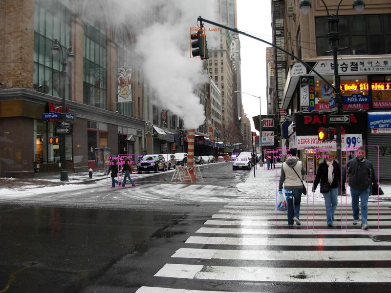

# [Implementing YOLO v3 in Tensorflow (TF-Slim)](https://itnext.io/implementing-yolo-v3-in-tensorflow-tf-slim-c3c55ff59dbe)



Recently I have been playing with YOLO v3 object detector in Tensorflow. I couldn’t find any implementation suitable for my needs on GitHub, thus I decided to convert [this](https://blog.paperspace.com/how-to-implement-a-yolo-object-detector-in-pytorch/) code written in PyTorch to Tensorflow. Original configuration of YOLO v3, published alongside the paper can be found in Darknet GitHub repo [here](https://github.com/pjreddie/darknet).

I would like to share my code along with the solutions to some problems with which I struggled when implementing it.

I won’t focus much on aspects not related to the implementation. I assume you are familiar with CNN’s, object detection, YOLO v3 architecture etc. as well as Tensorflow and TF-Slim framework. If not, it may be better to start with corresponding papers/tutorials. I won’t explain what each single line does, rather present working code with explanations about some problems I stumbled upon.

All code needed to run this detector and some demo are available in my GitHub [repo](https://github.com/mystic123/tensorflow-yolo-v3). I tested in on Ubuntu 16.04, Tensorflow 1.8.0 and CUDA 9.0.

This post is organized as follows:

> 1. Setup
> 2. Implementation of Darknet-53 layers
> 3. Implementation of YOLO v3 detection layers
> 4. Converting pre-trained COCO weights
> 5. Implementation of post-processing algorithms
> 6. Summary

## 1. Setup
I want to organise the code in a way similar to how it is organised in Tensorflow `models` [repository](https://github.com/tensorflow/models). I use TF-Slim, because it let’s us define common arguments such as activation function, batch normalization parameters etc. as globals, thus makes defining neural networks much faster.

We start with `yolo_v3.py` file, where we will put functions which initialize the net as well as functions to load pre-trained weights.

```python
# -*- coding: utf-8 -*-

import tensorflow as tf

slim = tf.contrib.slim


def darknet53(inputs):
    """
    Builds Darknet-53 model.
    """
    pass


def yolo_v3(inputs, num_classes, is_training=False, data_format='NCHW', reuse=False):
    """
    Creates YOLO v3 model.
    :param inputs: a 4-D tensor of size [batch_size, height, width, channels].
        Dimension batch_size may be undefined.
    :param num_classes: number of predicted classes.
    :param is_training: whether is training or not.
    :param data_format: data format NCHW or NHWC.
    :param reuse: whether or not the network and its variables should be reused.
    :return: 
    """
    pass


def load_weights(var_list, weights_file):
    """
    Loads and converts pre-trained weights.
    :param var_list: list of network variables.
    :param weights_file: name of the binary file.
    :return:
    """
    pass
```
Add the necessary constants (tuned by the authors of YOLO) somewhere on top of the file.
```
_BATCH_NORM_DECAY = 0.9
_BATCH_NORM_EPSILON = 1e-05
_LEAKY_RELU = 0.1
```
YOLO v3 normalizes the input to be in range 0..1. Most of the layers in the detector do batch normalization right after the convolution, do not have biases and use Leaky ReLU activation. It is convenient to define slim arg scope to handle this cases for use. In the layers which do not use BN and LReLU we will need to implicitly define that.
```
# transpose the inputs to NCHW
if data_format == 'NCHW':
    inputs = tf.transpose(inputs, [0, 3, 1, 2])

# normalize values to range [0..1]
inputs = inputs / 255

# set batch norm params
batch_norm_params = {
    'decay': _BATCH_NORM_DECAY,
    'epsilon': _BATCH_NORM_EPSILON,
    'scale': True,
    'is_training': is_training,
    'fused': None,  # Use fused batch norm if possible.
}

# Set activation_fn and parameters for conv2d, batch_norm.
with slim.arg_scope([slim.conv2d, slim.batch_norm, _fixed_padding], data_format=data_format, reuse=reuse):
    with slim.arg_scope([slim.conv2d], normalizer_fn=slim.batch_norm, normalizer_params=batch_norm_params,
                        biases_initializer=None, activation_fn=lambda x: tf.nn.leaky_relu(x, alpha=_LEAKY_RELU)):
        with tf.variable_scope('darknet-53'):
            inputs = darknet53(inputs)
```
We are now ready to define Darknet-53 layers.

## 2. Implementation of Darknet-53 layers.
In YOLO v3 paper, the authors present new, deeper architecture of feature extractor called Darknet-53. As it’s name suggests, it contains of 53 convolutional layers, each followed by batch normalization layer and Leaky ReLU activation. Downsampling is done by conv layers with `stride=2`.


Before we define convolutional layers, we have to realize that authors’ implementation uses fixed padding independently of input size. To achieve same behaviour, we can use the function below (I slightly modified code found [here](https://github.com/tensorflow/models/blob/master/official/resnet/resnet_model.py)).

```python
@tf.contrib.framework.add_arg_scope
def _fixed_padding(inputs, kernel_size, *args, mode='CONSTANT', **kwargs):
    """
    Pads the input along the spatial dimensions independently of input size.

    Args:
      inputs: A tensor of size [batch, channels, height_in, width_in] or
        [batch, height_in, width_in, channels] depending on data_format.
      kernel_size: The kernel to be used in the conv2d or max_pool2d operation.
                   Should be a positive integer.
      data_format: The input format ('NHWC' or 'NCHW').
      mode: The mode for tf.pad.

    Returns:
      A tensor with the same format as the input with the data either intact
      (if kernel_size == 1) or padded (if kernel_size > 1).
    """
    pad_total = kernel_size - 1
    pad_beg = pad_total // 2
    pad_end = pad_total - pad_beg

    if kwargs['data_format'] == 'NCHW':
        padded_inputs = tf.pad(inputs, [[0, 0], [0, 0],
                                        [pad_beg, pad_end], [pad_beg, pad_end]], mode=mode)
    else:
        padded_inputs = tf.pad(inputs, [[0, 0], [pad_beg, pad_end],
                                        [pad_beg, pad_end], [0, 0]], mode=mode)
    return padded_inputs

```

`_fixed_padding` pads input along height and width dimension with appropriate number of 0s (when `mode='CONSTANT'`). We will also use `mode='SYMMETRIC'` later on.

Now we can define `_conv2d_fixed_padding` function:

```python
def _conv2d_fixed_padding(inputs, filters, kernel_size, strides=1):
    if strides > 1:
        inputs = _fixed_padding(inputs, kernel_size)
    inputs = slim.conv2d(inputs, filters, kernel_size, stride=strides, padding=('SAME' if strides == 1 else 'VALID'))
    return inputs

```

Darknet-53 model is built from some number of blocks with 2 conv layers and shortcut connection followed by downsampling layer. To avoid boilerplate code, we define `_darknet_block` function:

```python
def _darknet53_block(inputs, filters):
    shortcut = inputs
    inputs = _conv2d_fixed_padding(inputs, filters, 1)
    inputs = _conv2d_fixed_padding(inputs, filters * 2, 3)

    inputs = inputs + shortcut
    return inputs

```

Finally, we have all required building blocks for the Darknet-53 model:

```python
def darknet53(inputs):
    """
    Builds Darknet-53 model.
    """
    inputs = _conv2d_fixed_padding(inputs, 32, 3)
    inputs = _conv2d_fixed_padding(inputs, 64, 3, strides=2)
    inputs = _darknet53_block(inputs, 32)
    inputs = _conv2d_fixed_padding(inputs, 128, 3, strides=2)

    for i in range(2):
        inputs = _darknet53_block(inputs, 64)

    inputs = _conv2d_fixed_padding(inputs, 256, 3, strides=2)

    for i in range(8):
        inputs = _darknet53_block(inputs, 128)

    inputs = _conv2d_fixed_padding(inputs, 512, 3, strides=2)

    for i in range(8):
        inputs = _darknet53_block(inputs, 256)

    inputs = _conv2d_fixed_padding(inputs, 1024, 3, strides=2)

    for i in range(4):
        inputs = _darknet53_block(inputs, 512)

    return inputs

```

Originally, there is global avg pool layer and softmax after the last block, but they are not used by YOLO v3 (so in fact, we have 52 layers instead of 53 ;) )

## 3. Implementation of YOLO v3 detection layers.
Features extracted by Darknet-53 are directed to the detection layers. The detection module is built from some number of conv layers grouped in blocks, upsampling layers and 3 conv layers with linear activation function, making detections at 3 different scales. Let’s start with writing helper function `_yolo_block`:

```python
def _yolo_block(inputs, filters):
    inputs = _conv2d_fixed_padding(inputs, filters, 1)
    inputs = _conv2d_fixed_padding(inputs, filters * 2, 3)
    inputs = _conv2d_fixed_padding(inputs, filters, 1)
    inputs = _conv2d_fixed_padding(inputs, filters * 2, 3)
    inputs = _conv2d_fixed_padding(inputs, filters, 1)
    route = inputs
    inputs = _conv2d_fixed_padding(inputs, filters * 2, 3)
    return route, inputs
```
Activations from 5th layer in the block are then routed to another conv layer and upsampled, while activations from 6th layer go to `_detection_layer` which we are going to define now:

```python
def _detection_layer(inputs, num_classes, anchors, img_size, data_format):
    num_anchors = len(anchors)
    predictions = slim.conv2d(inputs, num_anchors * (5 + num_classes), 1, stride=1, normalizer_fn=None,
                              activation_fn=None, biases_initializer=tf.zeros_initializer())

    shape = predictions.get_shape().as_list()
    grid_size = _get_size(shape, data_format)
    dim = grid_size[0] * grid_size[1]
    bbox_attrs = 5 + num_classes

    if data_format == 'NCHW':
        predictions = tf.reshape(predictions, [-1, num_anchors * bbox_attrs, dim])
        predictions = tf.transpose(predictions, [0, 2, 1])

    predictions = tf.reshape(predictions, [-1, num_anchors * dim, bbox_attrs])

    stride = (img_size[0] // grid_size[0], img_size[1] // grid_size[1])

    anchors = [(a[0] / stride[0], a[1] / stride[1]) for a in anchors]

    box_centers, box_sizes, confidence, classes = tf.split(predictions, [2, 2, 1, num_classes], axis=-1)

    box_centers = tf.nn.sigmoid(box_centers)
    confidence = tf.nn.sigmoid(confidence)

    grid_x = tf.range(grid_size[0], dtype=tf.float32)
    grid_y = tf.range(grid_size[1], dtype=tf.float32)
    a, b = tf.meshgrid(grid_x, grid_y)

    x_offset = tf.reshape(a, (-1, 1))
    y_offset = tf.reshape(b, (-1, 1))

    x_y_offset = tf.concat([x_offset, y_offset], axis=-1)
    x_y_offset = tf.reshape(tf.tile(x_y_offset, [1, num_anchors]), [1, -1, 2])

    box_centers = box_centers + x_y_offset
    box_centers = box_centers * stride

    anchors = tf.tile(anchors, [dim, 1])
    box_sizes = tf.exp(box_sizes) * anchors
    box_sizes = box_sizes * stride

    detections = tf.concat([box_centers, box_sizes, confidence], axis=-1)

    classes = tf.nn.sigmoid(classes)
    predictions = tf.concat([detections, classes], axis=-1)
    return predictions
```

This layer transforms raw predictions according to following equations. Because YOLO v3 on each scale detects objects of different sizes and aspect ratios , `anchors` argument is passed, which is a list of 3 tuples (height, width) for each scale. The anchors need to be tailored for dataset (in this tutorial we will use anchors for COCO dataset). Just add this constant somewhere on top of `yolo_v3.py` file.

```
_ANCHORS = [(10, 13), (16, 30), (33, 23), (30, 61), (62, 45), (59, 119), (116, 90), (156, 198), (373, 326)]
```


We need one small helper function `_get_size` which returns height and width of the input:

```python
def _get_size(shape, data_format):
    if len(shape) == 4:
        shape = shape[1:]
    return shape[1:3] if data_format == 'NCHW' else shape[0:2]
```

As mentioned earlier, the last building block that we need to implement YOLO v3 is upsampling layer. YOLO detector uses bilinear upsampling method. Why can’t we just use standard `tf.image.resize_bilinear` method from Tensorflow API? The reason is, as for today (TF version 1.8.0), all upsampling methods use constant pad mode. Standard pad method in YOLO authors repo and in PyTorch is edge (good comparison of padding modes can be found [here](http://scikit-image.org/docs/dev/auto_examples/transform/plot_edge_modes.html) ) . This minor difference has significant impact on the detections (and cost me a couple of hours of debugging).

To work around this we will manually pad inputs with 1 pixel and `mode='SYMMETRIC'`, which is the equivalent of edge mode.

```
# we just need to pad with one pixel, so we set kernel_size = 3
inputs = _fixed_padding(inputs, 3, 'NHWC', mode='SYMMETRIC')
```

Whole `_upsample` function code looks as follows:

```python
def _upsample(inputs, out_shape, data_format='NCHW'):
    # we need to pad with one pixel, so we set kernel_size = 3
    inputs = _fixed_padding(inputs, 3, mode='SYMMETRIC')

    # tf.image.resize_bilinear accepts input in format NHWC
    if data_format == 'NCHW':
        inputs = tf.transpose(inputs, [0, 2, 3, 1])

    if data_format == 'NCHW':
        height = out_shape[3]
        width = out_shape[2]
    else:
        height = out_shape[2]
        width = out_shape[1]

    # we padded with 1 pixel from each side and upsample by factor of 2, so new dimensions will be
    # greater by 4 pixels after interpolation
    new_height = height + 4
    new_width = width + 4

    inputs = tf.image.resize_bilinear(inputs, (new_height, new_width))

    # trim back to desired size
    inputs = inputs[:, 2:-2, 2:-2, :]

    # back to NCHW if needed
    if data_format == 'NCHW':
        inputs = tf.transpose(inputs, [0, 3, 1, 2])

    inputs = tf.identity(inputs, name='upsampled')
    return inputs
```

UPDATE: Thanks to [Srikanth Vidapanakal](https://www.linkedin.com/in/srikanth-vidapanakal-7463b18/), I checked the source code of darknet and found out that the upsampling method is nearest neighbor, not bilinear. We don’t need to pad image anymore. Updated code is already available in my repo.

Fixed `_upsample` function code looks as follows:

```python
def _upsample(inputs, out_shape, data_format='NCHW'):
    # tf.image.resize_nearest_neighbor accepts input in format NHWC
    if data_format == 'NCHW':
        inputs = tf.transpose(inputs, [0, 2, 3, 1])

    if data_format == 'NCHW':
        new_height = out_shape[3]
        new_width = out_shape[2]
    else:
        new_height = out_shape[2]
        new_width = out_shape[1]

    inputs = tf.image.resize_nearest_neighbor(inputs, (new_height, new_width))

    # back to NCHW if needed
    if data_format == 'NCHW':
        inputs = tf.transpose(inputs, [0, 3, 1, 2])

    inputs = tf.identity(inputs, name='upsampled')
    return inputs
```
Upsampled activations are concatenated along channels axis with activations from Darknet-53 layers. That is why we need to go back to `darknet53` function and return activations from conv layers before 4th and 5th downsampling layers.

```python
def darknet53(inputs):
    """
    Builds Darknet-53 model.
    """
    inputs = _conv2d_fixed_padding(inputs, 32, 3)
    inputs = _conv2d_fixed_padding(inputs, 64, 3, strides=2)
    inputs = _darknet53_block(inputs, 32)
    inputs = _conv2d_fixed_padding(inputs, 128, 3, strides=2)

    for i in range(2):
        inputs = _darknet53_block(inputs, 64)

    inputs = _conv2d_fixed_padding(inputs, 256, 3, strides=2)

    for i in range(8):
        inputs = _darknet53_block(inputs, 128)

    route1 = inputs
    inputs = _conv2d_fixed_padding(inputs, 512, 3, strides=2)

    for i in range(8):
        inputs = _darknet53_block(inputs, 256)

    route2 = inputs
    inputs = _conv2d_fixed_padding(inputs, 1024, 3, strides=2)

    for i in range(4):
        inputs = _darknet53_block(inputs, 512)

    return route1, route2, inputs
```

Now we are ready to define detector module. Let’s get back to `yolo_v3` function and add following lines under the slim arg scope:

```python
with tf.variable_scope('darknet-53'):
    route_1, route_2, inputs = darknet53(inputs)

with tf.variable_scope('yolo-v3'):
    route, inputs = _yolo_block(inputs, 512)
    detect_1 = _detection_layer(inputs, num_classes, _ANCHORS[6:9], img_size, data_format)
    detect_1 = tf.identity(detect_1, name='detect_1')

    inputs = _conv2d_fixed_padding(route, 256, 1)
    upsample_size = route_2.get_shape().as_list()
    inputs = _upsample(inputs, upsample_size, data_format)
    inputs = tf.concat([inputs, route_2], axis=1 if data_format == 'NCHW' else 3)

    route, inputs = _yolo_block(inputs, 256)

    detect_2 = _detection_layer(inputs, num_classes, _ANCHORS[3:6], img_size, data_format)
    detect_2 = tf.identity(detect_2, name='detect_2')

    inputs = _conv2d_fixed_padding(route, 128, 1)
    upsample_size = route_1.get_shape().as_list()
    inputs = _upsample(inputs, upsample_size, data_format)
    inputs = tf.concat([inputs, route_1], axis=1 if data_format == 'NCHW' else 3)

    _, inputs = _yolo_block(inputs, 128)

    detect_3 = _detection_layer(inputs, num_classes, _ANCHORS[0:3], img_size, data_format)
    detect_3 = tf.identity(detect_3, name='detect_3')

    detections = tf.concat([detect_1, detect_2, detect_3], axis=1)
    return detections
```

## 4. Converting pre-trained COCO weights
We defined detector’s architecure. To use it, we have to either train it on our own dataset or use pretrained weights. Weights pretrained on COCO dataset are available for public use. We can download it using this command:
```
wget https://pjreddie.com/media/files/yolov3.weights
```
The structure of this binary file is as follows:

The first 3 int32 values are header information: major version number, minor version number, subversion number, followed by int64 value: number of images seen by the network during training. After them, there are 62 001 757 float32 values which are weights of each conv and batch norm layer. It is important to remember that they are saved in row-major format, which is opposite to format used by Tensorflow (column-major).

### So, how should we read the weights from this file?

We start from the first conv layer. Most of the convolution layers are immediately followed by batch normalization layer. In this case, we need to read first read 4* `num_filters` weights of batch norm layer: gamma, beta, moving mean and moving variance, `thenkernel_size[0] * kernel_size[1] * num_filters * input_channels` weights of conv layer.

In the opposite case, when conv layer is not followed by batch norm layer, instead of reading batch norm params, we need to `readnum_filters` bias weights.

Let’s start writing code of `load_weights` function. It takes 2 arguments: a list of variables in our graph and a name of the binary file.

We start with opening the file, skipping first 5 int32 values and reading everything else as a list:

```python
def load_weights(var_list, weights_file):
    with open(weights_file, "rb") as fp:
        _ = np.fromfile(fp, dtype=np.int32, count=5)

        weights = np.fromfile(fp, dtype=np.float32)
```

Then we will use two pointers, first to iterate over the list of variables `var_list` and second to iterate over the list with loaded variables `weights`. We need to check the type of the layer following the one currently processed and read appriopriate number of values. In the code `i` will be iterating over `var_list` and `ptr` will be iterating over `weights`. We will return a list of `tf.assign` ops. I check the type of the layer simply by comparing it’s name. (I agree that it is a little ugly, but I don’t know any better way of doing it. This approach seems to work for me.)

```python
ptr = 0
i = 0
assign_ops = []
while i < len(var_list) - 1:
    var1 = var_list[i]
    var2 = var_list[i + 1]
    # do something only if we process conv layer
    if 'Conv' in var1.name.split('/')[-2]:
        # check type of next layer
        if 'BatchNorm' in var2.name.split('/')[-2]:
            # load batch norm params
            gamma, beta, mean, var = var_list[i + 1:i + 5]
            batch_norm_vars = [beta, gamma, mean, var]
            for var in batch_norm_vars:
                shape = var.shape.as_list()
                num_params = np.prod(shape)
                var_weights = weights[ptr:ptr + num_params].reshape(shape)
                ptr += num_params
                assign_ops.append(tf.assign(var, var_weights, validate_shape=True))

            # we move the pointer by 4, because we loaded 4 variables
            i += 4
        elif 'Conv' in var2.name.split('/')[-2]:
            # load biases
            bias = var2
            bias_shape = bias.shape.as_list()
            bias_params = np.prod(bias_shape)
            bias_weights = weights[ptr:ptr + bias_params].reshape(bias_shape)
            ptr += bias_params
            assign_ops.append(tf.assign(bias, bias_weights, validate_shape=True))

            # we loaded 2 variables
            i += 1
        # we can load weights of conv layer
        shape = var1.shape.as_list()
        num_params = np.prod(shape)

        var_weights = weights[ptr:ptr + num_params].reshape((shape[3], shape[2], shape[0], shape[1]))
        # remember to transpose to column-major
        var_weights = np.transpose(var_weights, (2, 3, 1, 0))
        ptr += num_params
        assign_ops.append(tf.assign(var1, var_weights, validate_shape=True))
        i += 1
return assign_ops
```

And that’s it! Now we can restore the weights of the model by executing lines of code similar to these:

```python
with tf.variable_scope('model'):
    model = yolo_v3(inputs, 80)
model_vars = tf.global_variables(scope='model')
assign_ops = load_variables(model_vars, 'yolov3.weights')
sess = tf.Session()
sess.run(assign_ops)
For the future use, it will probably be much easier to export the weights using tf.train.Saver and load from a checkpoint.
```

## 5. Implementation of post-processing algorithms
Our model returns a tensor of shape:
```
batch_size x 10647 x (num_classes + 5 bounding box attrs)
```

The number 10647 is equal to the sum 507 +2028 + 8112, which are the numbers of possible objects detected on each scale. The 5 values describing bounding box attributes stand for `center_x`, `center_y`, `width`, `height`. In most cases, it is easier to work on coordinates of two points: top left and bottom right. Let’s convert the output of the detector to this format.

The function which does it is pretty straightforward:

```python
def detections_boxes(detections):
    center_x, center_y, width, height, attrs = tf.split(detections, [1, 1, 1, 1, -1], axis=-1)
    w2 = width / 2
    h2 = height / 2
    x0 = center_x - w2
    y0 = center_y - h2
    x1 = center_x + w2
    y1 = center_y + h2

    boxes = tf.concat([x0, y0, x1, y1], axis=-1)
    detections = tf.concat([boxes, attrs], axis=-1)
    return detections
```
It is usual that our detector detects the same object multiple times (with slightly different centers and sizes). In most cases we don’t want to keep all of these detections which differ only by a small number of pixels. The standard solution to this problem is Non-max suppression. Good description of this method is available [here](https://www.coursera.org/learn/convolutional-neural-networks/lecture/dvrjH/non-max-suppression).

Why don’t we use the `tf.image.non_max_suppression` function from Tensorflow API? There are 2 main reasons. First, in my opinion it is much better to perform NMS per class, because we may have a situation where objects from 2 different classes highly overlap and global NMS will suppress one of the boxes. Second, some people are complaining that this function is slow, because it hasn’t been optimized yet.

Let’s implement the NMS algorithm. First we need a function to compute IoU (Intersection over Union) of two bounding boxes:

```python
def _iou(box1, box2):
    b1_x0, b1_y0, b1_x1, b1_y1 = box1
    b2_x0, b2_y0, b2_x1, b2_y1 = box2

    int_x0 = max(b1_x0, b2_x0)
    int_y0 = max(b1_y0, b2_y0)
    int_x1 = min(b1_x1, b2_x1)
    int_y1 = min(b1_y1, b2_y1)

    int_area = (int_x1 - int_x0) * (int_y1 - int_y0)

    b1_area = (b1_x1 - b1_x0) * (b1_y1 - b1_y0)
    b2_area = (b2_x1 - b2_x0) * (b2_y1 - b2_y0)

    iou = int_area / (b1_area + b2_area - int_area + 1e-05)
    return iou
```

Now we can write code of `non_max_suppression` function. I use NumPy library for fast vector operations.

```python
def non_max_suppression(predictions_with_boxes, confidence_threshold, iou_threshold=0.4):
    """
    Applies Non-max suppression to prediction boxes.

    :param predictions_with_boxes: 3D numpy array, first 4 values in 3rd dimension are bbox attrs, 5th is confidence
    :param confidence_threshold: the threshold for deciding if prediction is valid
    :param iou_threshold: the threshold for deciding if two boxes overlap
    :return: dict: class -> [(box, score)]
    """
```
It takes 3 arguments: outputs from our YOLO v3 detector, confidence threshold and IoU threshold. The body of this function is as follows:

```python
conf_mask = np.expand_dims((predictions_with_boxes[:, :, 4] > confidence_threshold), -1)
predictions = predictions_with_boxes * conf_mask

result = {}
for i, image_pred in enumerate(predictions):
    shape = image_pred.shape
    non_zero_idxs = np.nonzero(image_pred)
    image_pred = image_pred[non_zero_idxs]
    image_pred = image_pred.reshape(-1, shape[-1])

    bbox_attrs = image_pred[:, :5]
    classes = image_pred[:, 5:]
    classes = np.argmax(classes, axis=-1)

    unique_classes = list(set(classes.reshape(-1)))

    for cls in unique_classes:
        cls_mask = classes == cls
        cls_boxes = bbox_attrs[np.nonzero(cls_mask)]
        cls_boxes = cls_boxes[cls_boxes[:, -1].argsort()[::-1]]
        cls_scores = cls_boxes[:, -1]
        cls_boxes = cls_boxes[:, :-1]

        while len(cls_boxes) > 0:
            box = cls_boxes[0]
            score = cls_scores[0]
            if not cls in result:
                result[cls] = []
            result[cls].append((box, score))
            cls_boxes = cls_boxes[1:]
            ious = np.array([_iou(box, x) for x in cls_boxes])
            iou_mask = ious < iou_threshold
            cls_boxes = cls_boxes[np.nonzero(iou_mask)]
            cls_scores = cls_scores[np.nonzero(iou_mask)]

return result
```
That’s pretty much it. We implemented all functions needed for YOLO v3 to work.

## 6. Summary
In the tutorial [repo](https://github.com/mystic123/tensorflow-yolo-v3) you can find the code and some demo script for running detections. The detector works in both NHWC and NCHW data formats, so you can easily choose which format works faster on your machine.

If you have any questions, please don’t hesitate to contact me.

I plan to write next part of this tutorial in which I will show how to train (fine-tune) YOLO v3 on custom datasets.