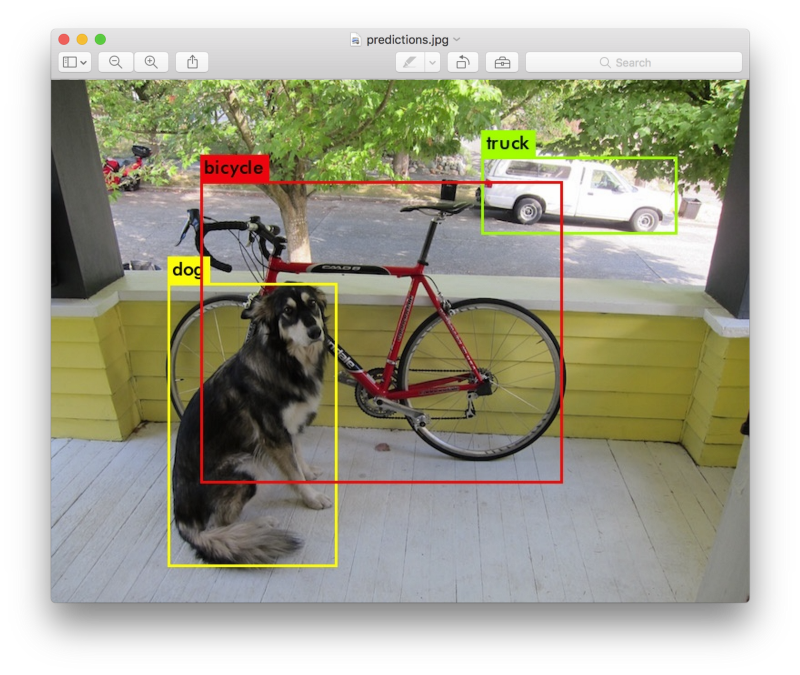
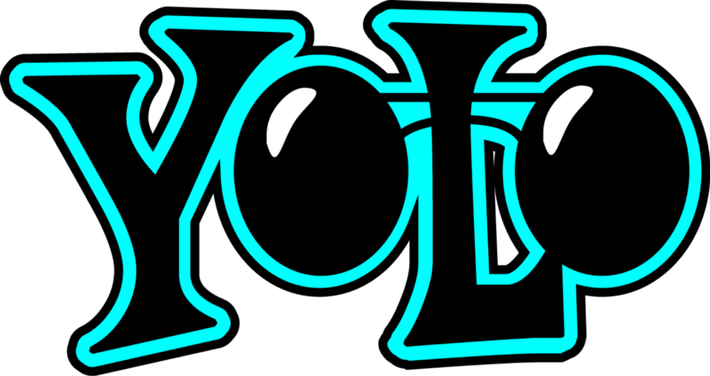
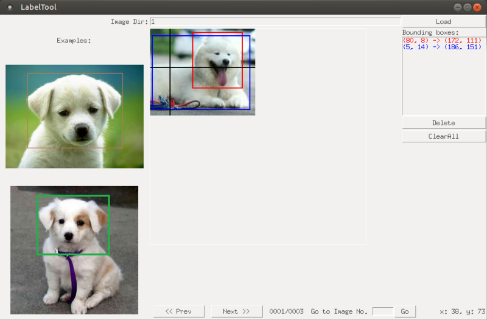

# [Object detection with YOLO: implementations and how to use them](https://medium.com/@enriqueav/object-detection-with-yolo-implementations-and-how-to-use-them-5da928356035)

Most of the Machine Learning projects that we are considering in the company I recently joined involve in one way or another some kind of object detection. Object detection in images means not only identify what kind of object is included, but also localize it inside the image (obtain the coordinates of the “bounding box” containing the object). In other words, **detection = classification + localization**.



Luckily I had enough time to spend the first weeks of my new job investigating the state of the art in systems and algorithms for object detection. Like pretty much any kind of problem recently, all roads took me to Deep Learning. After comparing several alternatives, I decided to deeper explore YOLO as my first option, mainly because it is thoroughly explained in the course about Convolutional Neural Networks (CNN) I have been studying for the last few months in Coursera (https://www.deeplearning.ai/), and of course also because of the name ;).

> See http://cv-tricks.com/object-detection/faster-r-cnn-yolo-ssd/ for a great comparison about the different algorithms.

## YOLO: You Only Look Once



Without getting much into details (I would like to create another story about the details on how it works), I want to focus on the different implementations and how to use them. **YOLO (You Only Look Once)** uses deep learning and convolutional neural networks (CNN) for object detection, it stands out from its “competitors” because, as the name indicates it only needs to “see” each image once. This allows YOLO to be one of the fastest detection algorithms (naturally sacrificing some accuracy). Thanks to this swiftness YOLO can detect objects in real time (up to 30 FPS).

To carry out the detection, the image is divided in a grid of SxS (left image). Each one of the cells will predict N possible “bounding boxes” and the level of certainty (or probability) of each one of them (image at the center), this means SxSxN boxes are calculated. The vast majority of these boxes will have a very low probability, that’s why the algorithm proceeds to delete the boxes that are below a certain threshold of minimum probability. The remaining boxes are passed through a “non-max suppression” that will eliminate possible duplicate objects and thus only leave the most exact of them (image on the right).


At the moment of writing this, YOLO has gone through three iterations, each one of them is a gradual improvement over the previous one. You can check each one of the articles:

- The original. You Only Look Once: Unified, Real-Time Object Detection https://arxiv.org/pdf/1506.02640.pdf
- The second version. YOLO9000: Better, Faster, Stronger https://arxiv.org/pdf/1612.08242.pdf (Yes, the name is inspired by the Daft Punk song!)
- The third version. YOLOv3: An Incremental Improvement https://pjreddie.com/media/files/papers/YOLOv3.pdf

## Implementations

Currently there are 3 main implementations of YOLO, each one of them with advantages and disadvantages

- **Darknet** (https://pjreddie.com/darknet/). This is the “official” implementation, created by the same people behind the algorithm. It is written in C with CUDA, hence it supports GPU computation. It is actually a complete neural network framework, so it really can be used for other objectives besides YOLO detection. The disadvantage is that, since it is written from the ground up (not based on a stablished neural network framework) it may be more difficult to find answers for errors you might encounter (happened to me more than once).
- **AlexeyAB/darknet** (https://github.com/AlexeyAB/darknet). Here I am actually cheating a little bit because it is actually a fork of Darknet to support Windows and Linux. I haven’t actually used this one, but I have checked the README many times, it is an excellent source to find tips and recommendations about YOLO in general, how to prepare you training set, how to train the network, how to improve object detection, etc.
- **Darkflow** (https://github.com/thtrieu/darkflow/). This is port of Darknet to work over TensorFlow. This is the system I have used the most, mainly because I started this project without having a GPU to train the network and apparently using CPU-only Darkflow is several times faster than the original Darkent. AFAIK the main disadvantage is that it has not been updated to YOLOv3.

All these implementations come “ready to use”, which means you only need to download and install them to start detecting images or videos right away using already trained weights available to download. Naturally this detection will be limited to classes contained in the datasets used to obtain this weights.


As you might expect, the true power of all these implementations is that you can train them to detect new classes. Like most of machine learning problems, one of the first troubles is to either obtain or create our own dataset.

## Creating the dataset to train new classes

A training set for YOLO consists in a series of images, each one must come with a text file indicating the coordinates and the class of each of the objects present in the image (I may add that is possible and even advisable to add some images with no objects at all).

Unfortunately right now there seems to be no standard on how to represent this information. In other words each of the systems expect a different format to represent the bounding box and class of each object:

- Darknet uses a very simple text file, with the following format:

```
[category number] [object center in X] [object center in Y] [object width in X] [object width in Y]
```

- Darkflow expects the annotations in the same format of the PASCAL VOC dataset, that is the one used by ImageNet. Is an xml file like the following example:


```xml
<annotation>
<folder>map_text/images</folder>
<filename>_ATRP_0001_003_001.JPEG</filename>
<size>
<width>608</width>
<height>608</height>
<depth>3</depth>
</size>
<segmented>0</segmented>
<object>
<name>map_text</name>
<pose>center</pose>
<truncated>1</truncated>
<difficult>0</difficult>
<bndbox>
<xmin>6</xmin>
<ymin>318</ymin>
<xmax>97</xmax>
<ymax>409</ymax>
</bndbox>
</object>
<!-- more object instances -->
</annotation>
```

## Tools to create the training set

There are several tools that can be used to create the annotations for each one of the images that will be part of the training set. This means, to manually indicate the “bounding box” containing each one of the objects in the image and indicate to which class the object belongs.



- **Yolo Mark** (https://github.com/AlexeyAB/Yolo_mark). Created by the same people behind the Windows fork. Saves the annotations in the format expected by Darknet.
- **LabelImg** (https://github.com/tzutalin/labelImg). Saves the annotations in the PASCAL VOC format, the one used natively by Darkflow.
- **BBox-Label-Tool** (https://github.com/puzzledqs/BBox-Label-Tool). Saves the annotations in a format that as far as I know is not natively used by any of the YOLO implementations, besides, the master branch does not allow multiple classes per image.

Unfortunately, following a [tutorial](https://timebutt.github.io/static/how-to-train-yolov2-to-detect-custom-objects/) (which otherwise is amazing), I started (and almost finished) the creation of my training set using BBox-Label-Tool, so I had to also write python scripts to convert to the formats used by Darknet or Darkflow (I am checking with my company if we can open-source these scripts and put them in github or something similar).

### EXTRA

- **Enriqueav/BBox-Label-Tool** (https://github.com/enriqueav/BBox-Label-Tool). I have created a fork of BBox-Label-Tool that saves the annotations in the PASCAL VOC format (for Darkflow). Unfortunately I based my fork on the master branch instead of multi-class branch, so it can only work for a single class per image.

I am planning a more detailed tutorial, step by step, on how to use Darkflow, from the creation of the training set, training, validation, common errors, etc.

## More information, references:

**Coursera specialization in Deep Learning**:

- https://www.coursera.org/specializations/deep-learning

**About convolutional neural networks**:

- http://cs231n.github.io/convolutional-networks/

**Tutorials about training darknet**:

- https://timebutt.github.io/static/how-to-train-yolov2-to-detect-custom-objects/
- http://guanghan.info/blog/en/my-works/train-yolo/

