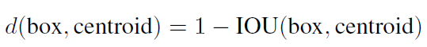
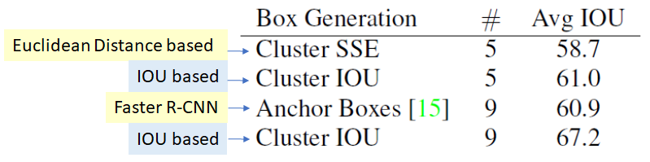
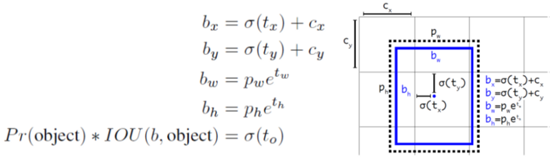
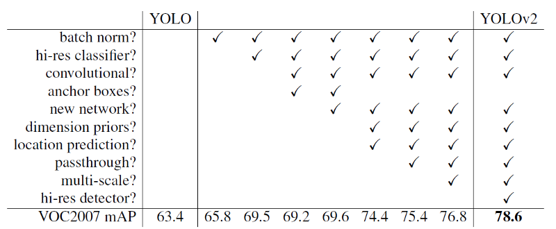
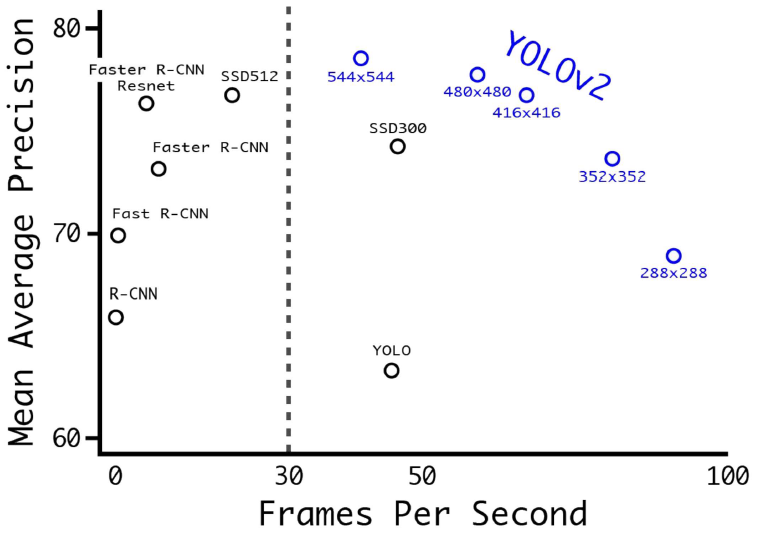
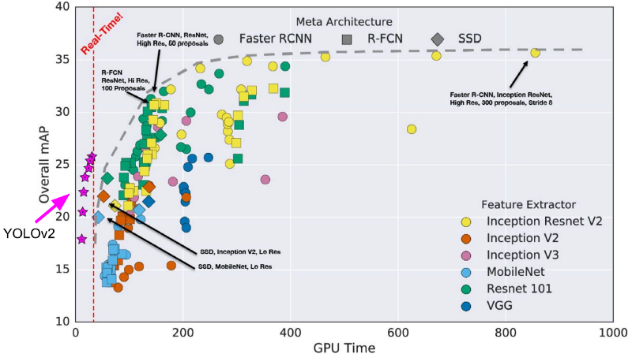
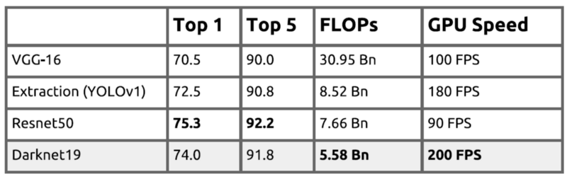
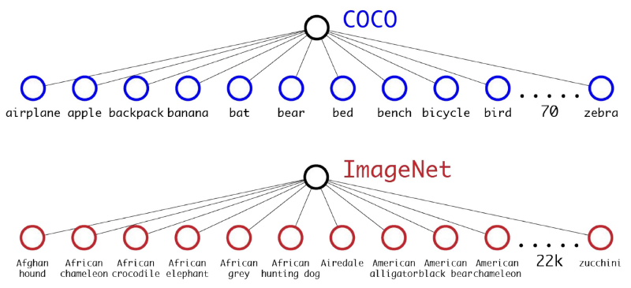
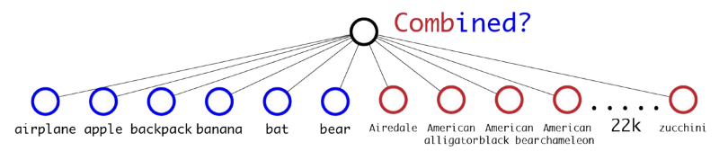
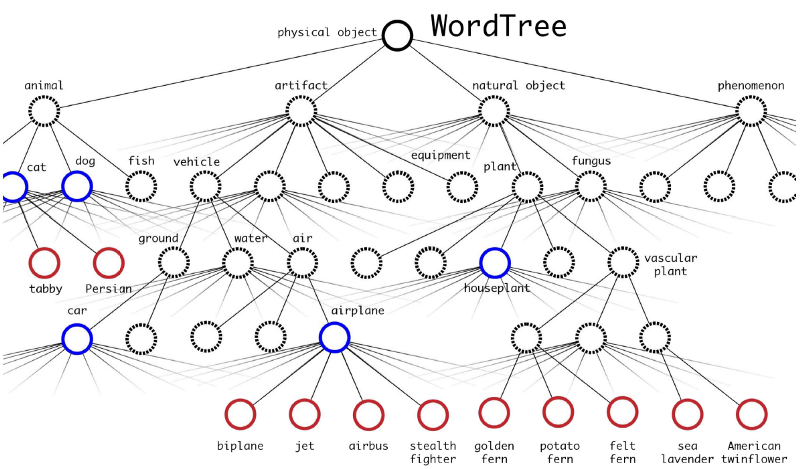

# [Review: YOLOv2 & YOLO9000 — You Only Look Once (Object Detection)](https://towardsdatascience.com/review-yolov2-yolo9000-you-only-look-once-object-detection-7883d2b02a65)

In this story, **YOLOv2, You Only Look Once version 2**, is reviewed. YOLOv2 has **numerous improvements over** [YOLOv1](https://towardsdatascience.com/yolov1-you-only-look-once-object-detection-e1f3ffec8a89). `YOLO9000` is also proposed to **detect over 9000 object categories using WordTree**.

Below (I believe) is the very famous YOLOv2 video by authors:

[Youtube]

**At 67 FPS, YOLOv2 gets 76.8% mAP on PASCAL VOC 2007. At 40 FPS, YOLOv2 gets 78.6% mAP** which is better than [Faster R-CNN](https://towardsdatascience.com/review-faster-r-cnn-object-detection-f5685cb30202) using [ResNet](https://towardsdatascience.com/review-resnet-winner-of-ilsvrc-2015-image-classification-localization-detection-e39402bfa5d8) and SSD. With such good results, YOLOv2 is published in **  ** and got over **1000 citations**. ([Sik-Ho Tsang](https://medium.com/@sh.tsang) @ Medium)

The paper title is “**YOLO9000: Better, Faster, Stronger**”.
So, let’s see how it can be **better**, **faster** and **stronger**!!!

---

### What Are Covered
1. YOLOv2 Improvements Over [YOLOv1][YOLOv1] (Better)
2. YOLOv2 Using Darknet-19 (Faster)
3. YOLO9000 by WordTree (Stronger)

## 1. YOLOv2 Improvements Over [YOLOv1][YOLOv1] (Better)

### 1.1. [Batch Normalization (BN)][Batch Normalization]
- [BN][Batch Normalization] is used on all convolutional layers in YOLOv2.
- 2% improvement in mAP.

### 1.2. High Resolution Classifier
- After trained by 224×224 images, YOLOv2 also uses 448×448 images for fine-tuning the classification network for 10 epochs on ImageNet.
- 4% increase in mAP.

### 1.3. Convolutions with Anchor Boxes
- YOLOv2 removes all fully connected layers and uses anchor boxes to predict bounding boxes.
- One pooling layer is removed to increase the resolution of output.
- And 416×416 images are used for training the detection network now.
- And 13×13 feature map output is obtained, i.e. 32× downsampled.
- Without anchor boxes, the intermediate model got 69.5% mAP and recall of 81%.
- With anchor boxes, 69.2% mAP and recall of 88% are obtained. Though mAP is dropped a little, recall is increased by large margin.

### 1.4. Dimension Clusters
- The sizes and scales of Anchor boxes were pre-defined without getting any prior information, just like the one in [Faster R-CNN][Faster R-CNN].
- Using standard Euclidean distance based k-means clustering is not good enough because larger boxes generate more error than smaller boxes
- YOLOv2 uses k-means clustering which leads to good IOU scores:

- k = 5 is the best value with good tradeoff between model complexity and high recall.

- IOU based clustering with 5 anchor boxes (61.0%) has similar results with the one in [Faster R-CNN][Faster R-CNN] with 9 anchor boxes (60.9%).
- IOU based clustering with 9 anchor boxes got 67.2%.

### 1.5. Direct Location Prediction
- [YOLOv1][YOLOv1] does not have constraints on location prediction which makes the model unstable at early iterations. The predicted bounding box can be far from the original grid location.
- YOLOv2 bounds the location using logistic activation σ, which makes the value fall between 0 to 1:

- (cx, cy) is the location of the grid.
- (bx, by) is the location of bounding box: (cx, cy) + delta bounded by σ(tx) and σ(ty).
- (pw, ph) is the anchor box prior got from clustering.
- (bw, bh) is the bounding box dimensions: (pw, ph) scaled by (tw, th).
- 5% increase in mAP over the version of anchor boxes.

### 1.6. Fine-Grained Features
- The 13×13 feature map output is sufficient for detecting large object.
- To detect small objects well, the 26×26×512 feature maps from earlier layer is mapped into 13×13×2048 feature map, then concatenated with the original 13×13 feature maps for detection.
- 1% increase in mAP is achieved.

### 1.7. Multi-Scale Training
- For every 10 batches, new image dimensions are randomly chosen.
- The image dimensions are {320, 352, …, 608}.
- The network is resized and continue training.

### 1.8. Summary on Incremental Improvements

- Network runs faster at smaller-size images.
- For low resolution YOLOv2, at 90 FPS, mAP is as good as [Fast R-CNN][Fast R-CNN], which is ideal for smaller GPUs.
- For high resolution YOLOv2, 76.8% mAP is obtained at real-time speed.

For MS COCO dataset, only YOLOv2 can get real-time performance among the approaches below:

## 2. YOLOv2 Using Darknet-19 (Faster)

Besides the above modification, Network architecture is also a factor of affecting the mAP.

Darknet-19 classification network is used in YOLOv2 for feature extraction:

We can see that Darknet-19 has many 1×1 convolutions to reduce the number of parameters. (If interested about the reason, please visit my review on [GoogLeNet].)

And Darknet-19 can obtain good balance between accuracy and model complexity:

With Top-1 and Top-5 Errors closed to [ResNet-50], Darknet-19 has lower model complexity (FLOP) and therefore much faster detection speed (FPS).

## 3. YOLO9000 by WordTree (Stronger)

There are multiple datasets for classification and detection. Authors have a thought, “Can they combine together?”

### 3.1. Combine

- `Microsoft COCO`: 100k images, 80 classes, detection labels, classes are more general like “dog” or “boat”.
- `ImageNet`: 13 million images, 22k classes, classification labels, classes are more specific like “Norfolk terrier”, “Yorkshire terrier”, or “Bedlington terrier”.
- The classes like “dog” and “Norfolk terrier” are not mutually exclusive.

We CANNOT directly combine them by just adding more classes as below:

To combine, WordTree is used:

As shown above, WordTree has a hierarchical tree to relate the classes and subclasses together. To be brief, Tree-based WordTree is built based on Graph-based WordNet by visualizing the nouns in ImageNet and choosing the shorter path in WordNet.

e.g.: “Norfolk terrier” is also labelled as “dog” and “mammal”.

If the network sees an image of “dog” but not sure which type it is, it will still predict as “dog” with high confidence, based on the conditional probability.

There are 9418 classes finally.

### 3.2. YOLO9000 Training

- 3 priors are used instead of 5 to limit the output size.
- For detection image, loss is backpropagated as normal.
- For classification image, only classification loss is backpropagated at or above the corresponding level of the label.

### 3.3. YOLO9000 Results

- 19.7% mAP is obtained.

Originally, MS COCO does not have so many ground-truth classes while ImageNet got classes but does not have the ground-truth bounding boxes.

Now YOLO9000 provides a way to combine them together.

## References

[2017 CVPR] [YOLOv2 & YOLO9000]

[YOLO9000: Better, Faster, Stronger](https://arxiv.org/abs/1612.08242)

## My Related Reviews
[[R-CNN]] [[Fast R-CNN]] [[Faster R-CNN]] [[SSD]] [[YOLOv1]] [[VGGNet]] [[ResNet]] [[GoogLeNet / Inception-v1][GoogLeNet]] [[Inception-v2 / BN-Inception]]

[YOLOv1]: https://towardsdatascience.com/yolov1-you-only-look-once-object-detection-e1f3ffec8a89

[Batch Normalization]: https://medium.com/@sh.tsang/review-batch-normalization-inception-v2-bn-inception-the-2nd-to-surpass-human-level-18e2d0f56651

[Faster R-CNN]: https://towardsdatascience.com/review-faster-r-cnn-object-detection-f5685cb30202
[Fast R-CNN]:   https://medium.com/coinmonks/review-fast-r-cnn-object-detection-a82e172e87ba
[GoogLeNet]:    https://medium.com/coinmonks/paper-review-of-googlenet-inception-v1-winner-of-ilsvlc-2014-image-classification-c2b3565a64e7

[R-CNN]: https://medium.com/coinmonks/review-r-cnn-object-detection-b476aba290d1
[SSD]: https://towardsdatascience.com/review-ssd-single-shot-detector-object-detection-851a94607d11 
[VGGNet]: https://medium.com/coinmonks/paper-review-of-vggnet-1st-runner-up-of-ilsvlc-2014-image-classification-d02355543a11

[ResNet]: https://towardsdatascience.com/review-resnet-winner-of-ilsvrc-2015-image-classification-localization-detection-e39402bfa5d8
[ResNet-50]:    https://towardsdatascience.com/review-resnet-winner-of-ilsvrc-2015-image-classification-localization-detection-e39402bfa5d8

[Inception-v2 / BN-Inception]: https://medium.com/@sh.tsang/review-batch-normalization-inception-v2-bn-inception-the-2nd-to-surpass-human-level-18e2d0f56651

