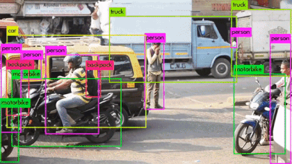
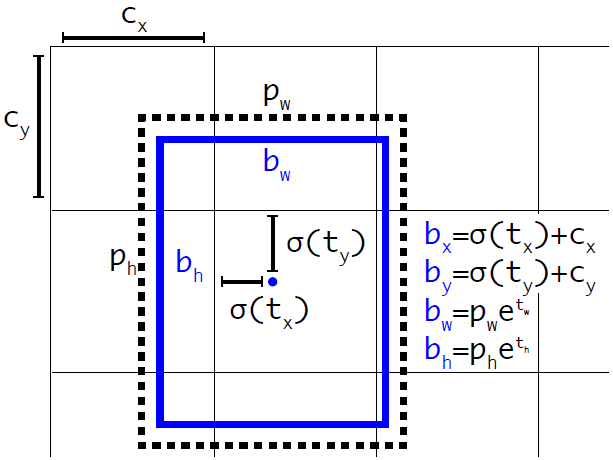
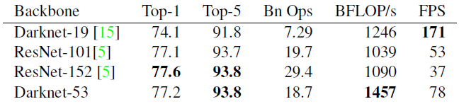
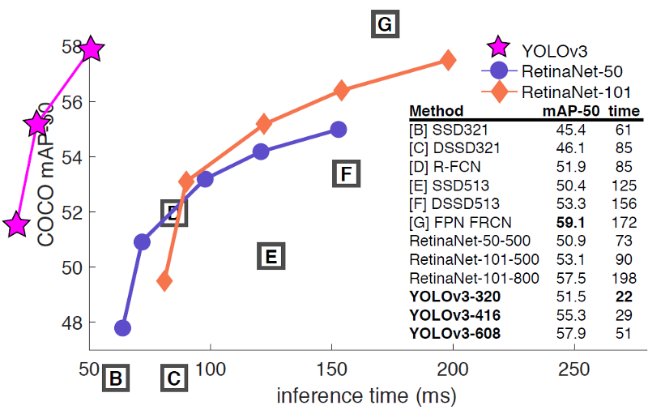
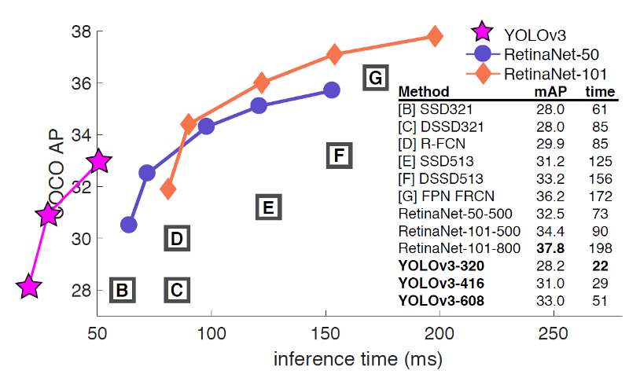
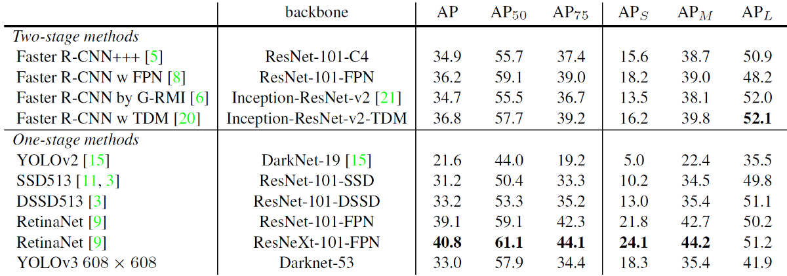
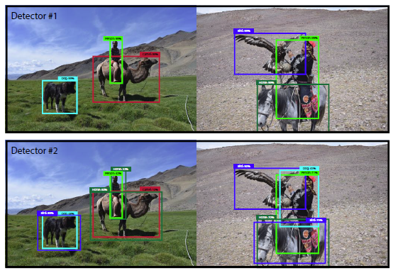

# [Review: YOLOv3 — You Only Look Once (Object Detection)](https://towardsdatascience.com/review-yolov3-you-only-look-once-object-detection-eab75d7a1ba6)

> Improved YOLOv2, Comparable Performance with RetinaNet, 3.8× Faster!

In this story, **YOLOv3 (You Only Look Once v3)**, by **University of Washington**, is reviewed. YOLO is a very famous object detector. I think everybody must know it. Below is the demo by authors:

[youtube]

As author was busy on Twitter and GAN, and also helped out with other people’s research, YOLOv3 has few incremental improvements on [YOLOv2](https://towardsdatascience.com/review-yolov2-yolo9000-you-only-look-once-object-detection-7883d2b02a65). For example, a better feature extractor, **DarkNet-53** with shortcut connections as well as a better object detector with **feature map upsampling and concatenation**. And it is published as a **2018 arXiv** technical report with more than **200 citations**. ([Sik-Ho Tsang](https://medium.com/@sh.tsang) @ Medium)

---

## Outline

1. Bounding Box Prediction
2. Class Prediction
3. Predictions Across Scales
4. Feature Extractor: Darknet-53
5. Results

## 1. Bounding Box Prediction

- It is the same as [YOLOv2](https://towardsdatascience.com/review-yolov2-yolo9000-you-only-look-once-object-detection-7883d2b02a65).
- **tx, ty, tw, th are predicted**.
- During training, sum of squared error loss is used.
- And objectness score is predicted using logistic regression. It is 1 if the bounding box prior overlaps a ground truth object by more than any other bounding box prior. Only one bounding box prior is assigned for each ground truth object.

---

## 2. Class Prediction

- Softmax is not used.
- Instead, **independent logistic classifiers** are used and **binary cross-entropy loss** is used. Because there may be overlapping labels for multilabel classification such as if the YOLOv3 is moved to other more complex domain such as Open Images Dataset.

## 3. Prediction Across Scales

- **3 different scales** are used.

- Features are extracted from these scales like [FPN](https://towardsdatascience.com/review-fpn-feature-pyramid-network-object-detection-262fc7482610).

- **Several convolutional layers are added to the base feature extractor Darknet-53** (which is mentioned in the next section).

- **The last of these layers predicts the bounding box, objectness and class predictions**.

- On COCO dataset, **3 boxes at each scales**. Therefore, the output tensor is `N×N×[3×(4+1+80)]`, i.e. `4 bounding box offsets, 1 objectness prediction, and 80 class predictions`.

- Next, the **feature map** is taken from 2 layers previous and is `upsampled by 2×`. A feature map is also taken from earlier in the network and merge it with our upsampled features using `concatenation`. This is actually the typical `encoder-decoder architecture`, just like [SSD](https://towardsdatascience.com/review-ssd-single-shot-detector-object-detection-851a94607d11) is evolved to [DSSD](https://towardsdatascience.com/review-dssd-deconvolutional-single-shot-detector-object-detection-d4821a2bbeb5).

- This method allows us to get **more meaningful semantic information** from the upsampled features and **finer-grained information** from the earlier feature map.

- Then, **a few more convolutional layers are added to process this combined feature map**, and eventually predict a similar tensor, although now twice the size.

- **k-means clustering** is used here as well to find **better bounding box prior**. Finally, on COCO dataset,  `(10×13)`, `(16×30)`, `(33×23)`, `(30×61)`, `(62×45)`, `(59×119)`, `(116×90)`, `(156×198)`, and `(373×326)` are used.

## 4. Feature Extractor: Darknet-53

- Darknet-19 classification network is used in [YOLOv2](https://towardsdatascience.com/review-yolov2-yolo9000-you-only-look-once-object-detection-7883d2b02a65) for feature extraction.
- Now, in YOLOv3, **a much deeper network Darknet-53** is used, i.e. 53 convolutional layers.
- Both [YOLOv2](https://towardsdatascience.com/review-yolov2-yolo9000-you-only-look-once-object-detection-7883d2b02a65) and `YOLOv3` also use Batch Normalization.
- **Shortcut connections** are also used as shown above.

**1000-Class ImageNet Comparison** (**Bn Ops**: Billions of Operations, **BFLOP/s**: Billion Floating Point Operation Per Second, **FPS**: Frame Per Second)

- 1000-class ImageNet Top-1 and Top5 error rates are measured as above.
- Single Crop 256×256 image testing is used, on a Titan X GPU.
- Compared with [ResNet-101](https://towardsdatascience.com/review-resnet-winner-of-ilsvrc-2015-image-classification-localization-detection-e39402bfa5d8), Darknet-53 has better performance (authors mentioned this in the paper) and it is 1.5× faster.
- Compared with [ResNet-152](https://towardsdatascience.com/review-resnet-winner-of-ilsvrc-2015-image-classification-localization-detection-e39402bfa5d8), Darknet-53 has similar performance (authors mentioned this in the paper) and it is 2× faster.

---

## 5. Results
### 5.1. COCO mAP@0.5

- As shown above, compared with [RetinaNet](https://towardsdatascience.com/review-retinanet-focal-loss-object-detection-38fba6afabe4), YOLOv3 got comparable mAP@0.5 with much faster inference time.
- For example, YOLOv3–608 got 57.9% mAP in 51ms while [RetinaNet-101–800](https://towardsdatascience.com/review-retinanet-focal-loss-object-detection-38fba6afabe4) only got 57.5% mAP in 198ms, which is 3.8× faster

### 5.2. COCO Overall mAP

- For overall mAP, YOLOv3 performance is dropped significantly.
- Nevertheless, YOLOv3–608 got 33.0% mAP in 51ms inference time while [RetinaNet-101–50–500](https://towardsdatascience.com/review-retinanet-focal-loss-object-detection-38fba6afabe4) only got 32.5% mAP in 73ms inference time.
- And YOLOv3 is on par with [SSD](https://towardsdatascience.com/review-ssd-single-shot-detector-object-detection-851a94607d11) variants with 3× faster.

### 5.3. Details

- YOLOv3 is much better than [SSD](https://towardsdatascience.com/review-ssd-single-shot-detector-object-detection-851a94607d11) and has similar performance as [DSSD](https://towardsdatascience.com/review-dssd-deconvolutional-single-shot-detector-object-detection-d4821a2bbeb5).
- And it is found that YOLOv3 has relatively good performance on AP_S but relatively bad performance on AP_M and AP_L.
- YOLOv3 has even better AP_S than two-stage Faster R-CNN variants using [ResNet](https://towardsdatascience.com/review-resnet-winner-of-ilsvrc-2015-image-classification-localization-detection-e39402bfa5d8), [FPN](https://towardsdatascience.com/review-fpn-feature-pyramid-network-object-detection-262fc7482610), [G-RMI](https://towardsdatascience.com/review-g-rmi-winner-in-2016-coco-detection-object-detection-af3f2eaf87e4), and [TDM](https://medium.com/datadriveninvestor/review-tdm-top-down-modulation-object-detection-3f0efe9e0151).

### 5.4. Qualitative Results

---
Actually, there are not much details on YOLOv3 in the technical report. Thus, I can only briefly review about it. It is recommended to be back and forth between [YOLOv2](https://towardsdatascience.com/review-yolov2-yolo9000-you-only-look-once-object-detection-7883d2b02a65) and YOLOv3 when reading YOLOv3. (And there are passages talking about the measurement of overall mAP. “Is it really reflecting the actual detection accuracy?” If interested, please visit the paper.)

---

Reference
[2018 arXiv] [YOLOv3]
YOLOv3: An Incremental Improvement

My Previous Reviews
Image Classification
[LeNet] [AlexNet] [ZFNet] [VGGNet] [SPPNet] [PReLU-Net] [STN] [DeepImage] [GoogLeNet / Inception-v1] [BN-Inception / Inception-v2] [Inception-v3] [Inception-v4] [Xception] [MobileNetV1] [ResNet] [Pre-Activation ResNet] [RiR] [RoR] [Stochastic Depth] [WRN] [FractalNet] [Trimps-Soushen] [PolyNet] [ResNeXt] [DenseNet] [PyramidNet]

Object Detection
[OverFeat] [R-CNN] [Fast R-CNN] [Faster R-CNN] [DeepID-Net] [R-FCN] [ION] [MultiPathNet] [NoC] [G-RMI] [TDM] [SSD] [DSSD] [YOLOv1] [YOLOv2 / YOLO9000] [FPN] [RetinaNet] [DCN]

Semantic Segmentation
[FCN] [DeconvNet] [DeepLabv1 & DeepLabv2] [ParseNet] [DilatedNet] [PSPNet] [DeepLabv3]

Biomedical Image Segmentation
[CUMedVision1] [CUMedVision2 / DCAN] [U-Net] [CFS-FCN] [U-Net+ResNet]

Instance Segmentation
[DeepMask] [SharpMask] [MultiPathNet] [MNC] [InstanceFCN] [FCIS]

Super Resolution
[SRCNN] [FSRCNN] [VDSR] [ESPCN] [RED-Net] [DRCN] [DRRN] [LapSRN & MS-LapSRN]