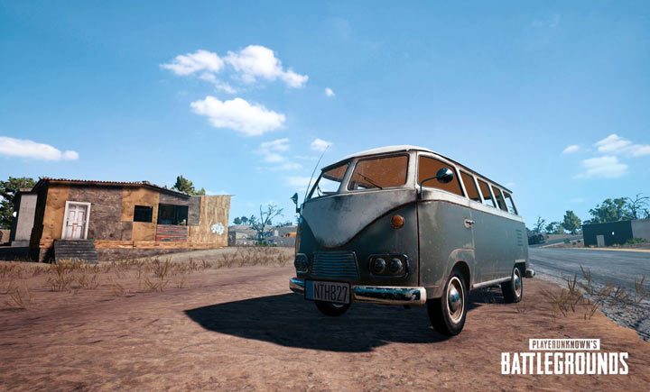

# [YOLO Object Detection with OpenCV and Python](https://www.arunponnusamy.com/yolo-object-detection-opencv-python.html)


Image Source: [DarkNet github repo](https://github.com/pjreddie/darknet/blob/master/data/dog.jpg)


If you have been keeping up with the advancements in the area of object detection, you might have got used to hearing this word 'YOLO'. It has kind of become a buzzword.

## What is YOLO exactly?

YOLO (You Only Look Once) is a method / way to do object detection. It is the algorithm /strategy behind how the code is going to detect objects in the image.

The official implementation of this idea is available through [DarkNet](https://pjreddie.com/darknet/) (neural net implementation from the ground up in 'C' from the author). It is available on `github` for people to use.

Earlier detection frameworks, looked at different parts of the image multiple times at different scales and repurposed image classification technique to detect objects. This approach is slow and inefficient.

YOLO takes entirely different approach. It looks at the entire image only once and goes through the network once and detects objects. Hence the name. It is very fast. That’s the reason it has got so popular.

There are other popular object detection frameworks like **Faster R-CNN** and **SSD** that are also widely used.

In this post, we are going to look at how to use a pre-trained YOLO model with OpenCV and start detecting objects right away.

## OpenCV dnn module

DNN (Deep Neural Network) module was initially part of `opencv_contrib` repo. It has been moved to the master branch of opencv repo last year, giving users the ability to run inference on pre-trained deep learning models within OpenCV itself.

(One thing to note here is, dnn module is not meant be used for training. It’s just for running inference on images/videos.)

Initially only Caffe and Torch models were supported. Over the period support for different frameworks/libraries like TensorFlow is being added.

Support for YOLO/DarkNet has been added recently. We are going to use the OpenCV dnn module with a pre-trained YOLO model for detecting common objects.

## Let’s get started ..

Enough of talking. Let’s start writing code. (in Python obviously)

```python
# import required packages
import cv2
import argparse
import numpy as np

# handle command line arguments
ap = argparse.ArgumentParser()
ap.add_argument('-i', '--image', required=True,
                help = 'path to input image')
ap.add_argument('-c', '--config', required=True,
                help = 'path to yolo config file')
ap.add_argument('-w', '--weights', required=True,
                help = 'path to yolo pre-trained weights')
ap.add_argument('-cl', '--classes', required=True,
                help = 'path to text file containing class names')
args = ap.parse_args()
```

### Installing dependencies

Following things are needed to execute the code we will be writing.

- Python 3
- Numpy
- OpenCV Python bindings

### Python 3

If you are on Ubuntu, it’s most likely that Python 3 is already installed. Run `python3` in terminal to check whether its installed. If its not installed use

```
sudo apt-get install python3
```

For macOS please refer my earlier post on [deep learning setup for macOS](http://www.arunponnusamy.com/deep-learning-setup-macos.html).

I highly recommend using Python **virtual environment**. Have a look at my earlier [post](http://www.arunponnusamy.com/deep-learning-setup-macos.html) if you need a starting point.

### Numpy

```
pip install numpy
```

This should install `numpy`. Make sure pip is linked to Python 3.x ( `pip -V` will show this info)

If needed use `pip3`. Use `sudo apt-get install python3-pip` to get `pip3` if not already installed.

### OpenCV-Python

You need to compile OpenCV from source from the master branch on [github](https://github.com/opencv/opencv) to get the Python bindings. (recommended)

Adrian Rosebrock has written a good blog post on [PyImageSearch](https://www.pyimagesearch.com/2017/09/25/configuring-ubuntu-for-deep-learning-with-python/) on this. (Download the source from master branch instead of from archive)

If you are feeling overwhelmed by the instructions to get OpenCV Python bindings from source, you can get the unofficial Python package using

```
pip install opencv-python
```

This is not maintained officially by [OpenCV.org](https://www.arunponnusamy.com/opencv.org). It’s a community maintained one. Thanks to the efforts of [Olli-Pekka Heinisuo](https://www.arunponnusamy.com/github.com/skvark).

### Command line arguments

The script requires four input arguments.

- input image
- YOLO config file
- pre-trained YOLO weights
- text file containing class names

All of these files are available on the [github](https://github.com/arunponnusamy/object-detection-opencv) repository I have put together. (link to download pre-trained weights is available in readme.)

You can also download the pre-trained weights in Terminal by typing

```
wget https://pjreddie.com/media/files/yolov3.weights
```

This particular model is trained on COCO dataset (common objects in context) from Microsoft. It is capable of detecting 80 common objects. See the full list [here](https://github.com/arunponnusamy/object-detection-opencv/blob/master/yolov3.txt).

Input image can be of your choice. Sample input is available in the [repo](https://github.com/arunponnusamy/object-detection-opencv).

Run the script by typing

```
python yolo_opencv.py --image dog.jpg --config yolov3.cfg --weights yolov3.weights --classes yolov3.txt
```

### Preparing input

```python
# read input image
image = cv2.imread(args.image)

Width = image.shape[1]
Height = image.shape[0]
scale = 0.00392

# read class names from text file
classes = None
with open(args.classes, 'r') as f:
    classes = [line.strip() for line in f.readlines()]

# generate different colors for different classes 
COLORS = np.random.uniform(0, 255, size=(len(classes), 3))

# read pre-trained model and config file
net = cv2.dnn.readNet(args.weights, args.config)

# create input blob 
blob = cv2.dnn.blobFromImage(image, scale, (416,416), (0,0,0), True, crop=False)

# set input blob for the network
net.setInput(blob)
```

Read the input image and get its width and height. 

Read the text file containing class names in human readable form and extract the class names to a list.

Generate different colors for different classes to draw bounding boxes.

```python
net = cv2.dnn.readNet(args.weights, args.config)
```

Above line reads the weights and config file and creates the network.

```python
blob = cv2.dnn.blobFromImage(image, scale, (Width,Height), (0,0,0), True, crop=False)

net.setInput(blob)
```

Above lines prepares the input image to run through the deep neural network.

### Output layer and bounding box

```python
# function to get the output layer names 
# in the architecture
def get_output_layers(net):
    
    layer_names = net.getLayerNames()
    
    output_layers = [layer_names[i[0] - 1] for i in net.getUnconnectedOutLayers()]

    return output_layers

# function to draw bounding box on the detected object with class name
def draw_bounding_box(img, class_id, confidence, x, y, x_plus_w, y_plus_h):

    label = str(classes[class_id])

    color = COLORS[class_id]

    cv2.rectangle(img, (x,y), (x_plus_w,y_plus_h), color, 2)

    cv2.putText(img, label, (x-10,y-10), cv2.FONT_HERSHEY_SIMPLEX, 0.5, color, 2)
```


Generally in a sequential CNN network there will be only one output layer at the end. In the YOLO v3 architecture we are using there are multiple output layers giving out predictions. `get_output_layers()` function gives the names of the output layers. An output layer is not connected to any next layer.

`draw_bounding_box()` function draws rectangle over the given predicted region and writes class name over the box. If needed, we can write the confidence value too.

### Running inference

```python
# run inference through the network
# and gather predictions from output layers
outs = net.forward(get_output_layers(net))

# initialization
class_ids = []
confidences = []
boxes = []
conf_threshold = 0.5
nms_threshold = 0.4

# for each detetion from each output layer 
# get the confidence, class id, bounding box params
# and ignore weak detections (confidence < 0.5)
for out in outs:
    for detection in out:
        scores = detection[5:]
        class_id = np.argmax(scores)
        confidence = scores[class_id]
        if confidence > 0.5:
            center_x = int(detection[0] * Width)
            center_y = int(detection[1] * Height)
            w = int(detection[2] * Width)
            h = int(detection[3] * Height)
            x = center_x - w / 2
            y = center_y - h / 2
            class_ids.append(class_id)
            confidences.append(float(confidence))
            boxes.append([x, y, w, h])
```

```python
outs = net.forward(get_output_layers(net))
```

Above line is where the exact feed forward through the network happens. Moment of truth. If we don’t specify the output layer names, by default, it will return the predictions only from final output layer. Any intermediate output layer will be ignored.

We need go through each detection from each output layer to get the class id, confidence and bounding box corners and more importantly ignore the weak detections (detections with low confidence value).

### Non-max suppression

```python
# apply non-max suppression
indices = cv2.dnn.NMSBoxes(boxes, confidences, conf_threshold, nms_threshold)

# go through the detections remaining
# after nms and draw bounding box
for i in indices:
    i = i[0]
    box = boxes[i]
    x = box[0]
    y = box[1]
    w = box[2]
    h = box[3]
    
    draw_bounding_box(image, class_ids[i], confidences[i], round(x), round(y), round(x+w), round(y+h))

# display output image    
cv2.imshow("object detection", image)

# wait until any key is pressed
cv2.waitKey()
    
 # save output image to disk
cv2.imwrite("object-detection.jpg", image)

# release resources
cv2.destroyAllWindows()
```

Even though we ignored weak detections, there will be lot of duplicate detections with overlapping bounding boxes. Non-max suppression removes boxes with high overlapping.


Source: [PyImageSearch](https://www.pyimagesearch.com/2018/05/14/a-gentle-guide-to-deep-learning-object-detection/)

Finally we look at the detections that are left and draw bounding boxes around them and display the output image.


---


---




I do not own the copyright for the images used in this post. Please refer source for copyright info.

## Summary

In this post, we looked at how to use OpenCV dnn module with pre-trained YOLO model to do object detection. We can also train a model to detect objects of our own interest that are not covered in the pre-trained one.

We have only scratched the surface. There is a lot more to object detection. I will be covering more on object detection in the future including other frameworks like Faster R-CNN and SSD. Be sure to [subscribe](http://eepurl.com/dtoOc9) to get notified when new posts are published.

### Update :

Checkout the object detection implementation available in [cvlib](http://cvlib.net/) which enables detecting common objects in the context through a single function call detect_common_objects(). Give it a shot and let me know your thoughts. Cheers.
